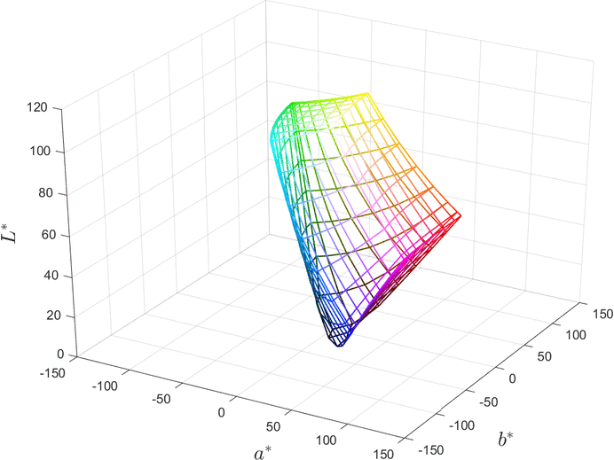
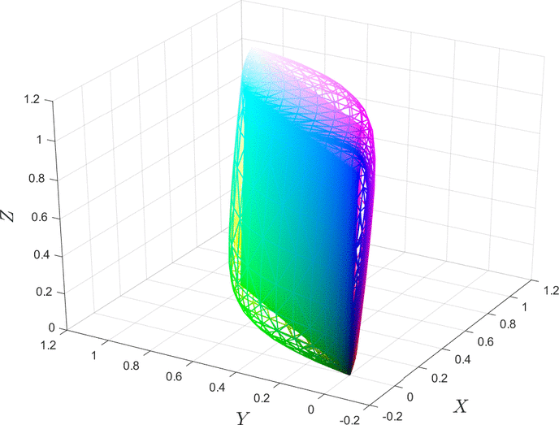
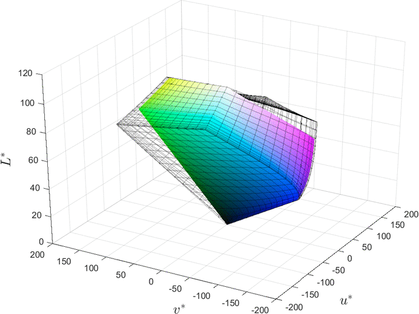

# Descriptions

> **ChromIQ Gamut Viewer** is a fork of [Yet Another Color Gamut
> Visualizer](https://github.com/QiuJueqin/Yet-Another-Color-Gamut-Visualizer)
> by Qiu Jueqin, ported from MATLAB to Python and extended considerably. The
> original is MIT licensed, which permits redistributing a modified copy under
> another name so long as the copyright and permission notice travel with it —
> `LICENSE` is kept exactly as inherited. The name changed because it grew into
> a companion to [ChromIQ](https://github.com/itsab1989/ChromIQ) and reads the
> files ChromIQ produces; the maths at its heart is still Qiu Jueqin's idea.


<p align="center">
  <a href="https://ko-fi.com/itsab1989"></a>
  <br>
  <sub>The ChromIQ Gamut Viewer is free and always will be. If it's useful to you, a coffee is a kind way to say thanks — completely optional, and it stays fully featured either way.</sub>
</p>

This tool helps to visualize color volume by constructing a 3D gamut given point cloud of color values. Please see [gamutview.m](gamutview.m) for more detailed descriptions.


# Examples

## Visualization of sRGB gamut in CIELAB color space

```
[r, g, b] = meshgrid(linspace(0, 1, 8));
rgb = [r(:), g(:), b(:)];
gamutview(rgb, rgb, 'srgb', 'facecolor', 'none');
```

<br>



<br>

> The animation was created by [animated-gif creator](https://www.mathworks.com/matlabcentral/fileexchange/28766-animated-gif-creator).


## Comparison of visible gamut and sRGB gamut in CIE1931 XYZ color space

```
[r, g, b] = meshgrid(linspace(0, 1, 8));
rgb = [r(:), g(:), b(:)];
[~, ~, hax] = gamutview(rgb, [], 'srgb2xyz', 'edgecolor', 'none');

load('visible_spectra.mat');
xyz = spectra2colors(visible_spectra, wavelengths, 'spd', 'd65');

vol_visible = gamutview(xyz, [], 'xyz2xyz', 'facecolor', 'none', 'parent', hax);
```

<br>



<br>


## Gamuts comparison for sRGB (solid) and Adobe RGB (black grid) in CIELUV color space

```
[r, g, b] = meshgrid(linspace(0, 1, 16));
rgb = [r(:), g(:), b(:)];
[~, ~, hax] = gamutview(rgb, rgb, 'srgb2luv', 'edgecolor', 'none');
gamutview(rgb, rgb, 'argb2luv', 'facecolor', 'none', 'edgecolor', 'k', 'edgealpha', .25, 'parent', hax);
```

<br>



<br>

Please see [demo/gamutview_demo.m](demo/gamutview_demo.m) for more usage guides.


# License

Copyright 2019 Qiu Jueqin

Licensed under [MIT](http://opensource.org/licenses/MIT).