# ChromIQ Gamut Viewer

**See the colours your printer *actually* produced — not the ones its profile
claims it can.**

Open the measurement file your instrument wrote when you read a printed chart,
and this draws the solid shape those colours enclose. Then it answers the
questions that shape exists to answer: will the photos people send me survive
on this paper, which of my two papers should I use, has my printer drifted
since last month, and does my ICC profile actually describe what came off the
printer?

<p align="center">
  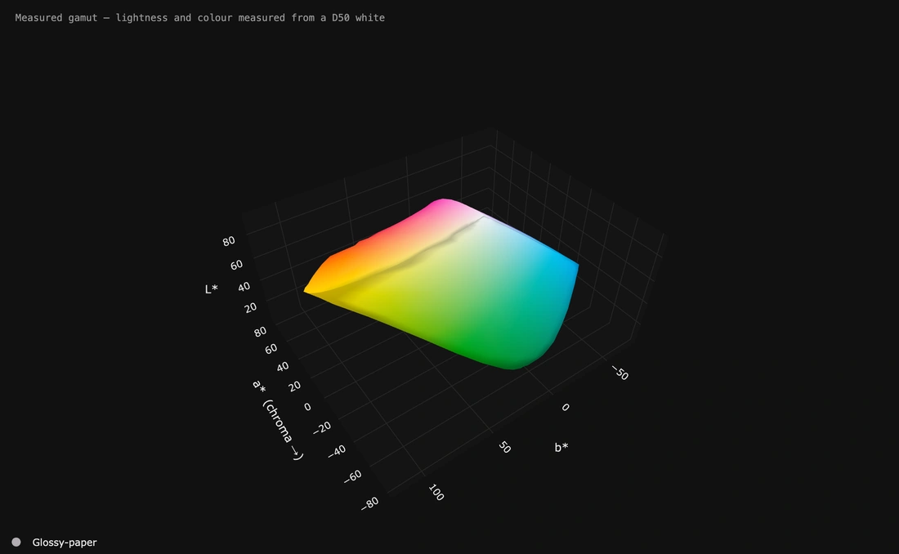
</p>

<p align="center"><sub>A real measured gamut, turning. Made by the
application itself — <b>Turn it by itself</b>, then <b>Save this view as a
picture…</b>. <a href="docs/MOTION.md">Seventeen more, over seven pages →</a></sub></p>

<p align="center">
  <a href="https://ko-fi.com/itsab1989"></a>
  <br>
  <sub>Free, and always will be. If it's useful to you a coffee is a kind way to say thanks — completely optional, and it stays fully featured either way.</sub>
</p>

> **A fork.** This began as [Yet Another Color Gamut
> Visualizer](https://github.com/QiuJueqin/Yet-Another-Color-Gamut-Visualizer)
> by Qiu Jueqin — a MATLAB tool whose real insight is at the heart of this one.
> It has been ported to Python, given a window, and extended a long way. The
> original is MIT licensed, which permits a modified copy under another name so
> long as the copyright notice travels with it; `LICENSE` is kept exactly as
> inherited. The name changed because it grew into a companion to
> [ChromIQ](https://github.com/itsab1989/ChromIQ) and reads the files ChromIQ
> produces.

---

## Why this is not the same as looking at your ICC profile

Most tools draw the gamut of a **finished ICC profile**. A profile is a fitted
model of your printer: it smooths, it interpolates, and near the edges it can
promise a little more or a little less than the paper really gave.

This draws the **measurements**. Every point on the surface is a patch that was
printed and read by an instrument.

|  | asks | answers |
|---|---|---|
| A profile's gamut | the finished ICC profile | what your printer is **described** as able to do |
| This | the measurement file | what it **did**, on that paper, on that day |

Holding the two against each other is a check you cannot easily make otherwise
— and it is [one of the six walkthroughs below](#5-does-my-icc-profile-match-what-my-printer-really-did).

---

## Getting it

Download the build for your machine from the
[**Releases**](https://github.com/itsab1989/ChromIQ-Gamut-Viewer/releases)
page. Nothing else needs installing — Python, Qt and the 3D viewer all travel
inside the download.

| Your computer | Download |
|---|---|
| Mac with Apple silicon (M1 and later) | `GamutViewer-macOS-arm64.zip` |
| Mac with an Intel processor | `GamutViewer-macOS-x86_64.zip` |
| Windows 10 or 11 on an Intel or AMD processor | `GamutViewer-Windows-x64.zip` |
| Windows 11 on ARM (Snapdragon X, and Windows in a virtual machine on an Apple-silicon Mac) | `GamutViewer-Windows-arm64.zip` |
| Linux, 64-bit Intel or AMD | `GamutViewer-Linux-x86_64.tar.gz` |
| Linux on ARM (including a Raspberry Pi 5) | `GamutViewer-Linux-aarch64.tar.gz` |

**On macOS**, the first launch needs a right-click → **Open** rather than a
double-click, because the build is not signed with a paid Apple developer
certificate. You only have to do that once.

Prefer to run from source? See [Running from
source](#running-from-source-and-the-tests) at the end.

### What you need to have ready

One **measured chart** — the file your instrument wrote after reading a printed
test chart. If you profile with [ArgyllCMS](https://www.argyllcms.com/) or with
[ChromIQ](https://github.com/itsab1989/ChromIQ), that is the `.ti3` file sitting
beside your profile. Other formats are listed under [What it
opens](#what-it-opens).

You do **not** need an internet connection or an account, and nothing about
you, your printer or your measurements is ever uploaded.

**One thing does reach the internet, and only one.** When the app starts it
asks this project's releases page a single question — "is there a newer
version?" — and tells you the answer. That is the whole of it. It sends no
account, no name, nothing about your computer, your printer or anything you
have measured, and it never downloads or installs a thing: if a newer version
exists, you get a version number and a link, and it is entirely up to you
whether you follow it.

It is switched on to begin with, because a colour tool quietly running a year
out of date helps nobody. If you would rather it did not, untick **Look for a
newer version when the app starts** under **This window** and it will never
look again — everything else in the app works with no network at all. You can
still check whenever you like with the **Check for a newer version…** button
just above it.

---

## Six things you can find out

Every screenshot below is the real window, driven through that exact step.

### 1. What can this paper actually print?

Open a measured chart — click **Open a measured chart…**, or drag the file onto
the window. The shape appears, painted in the colours it represents, and
**How much colour it holds** puts a number on it.

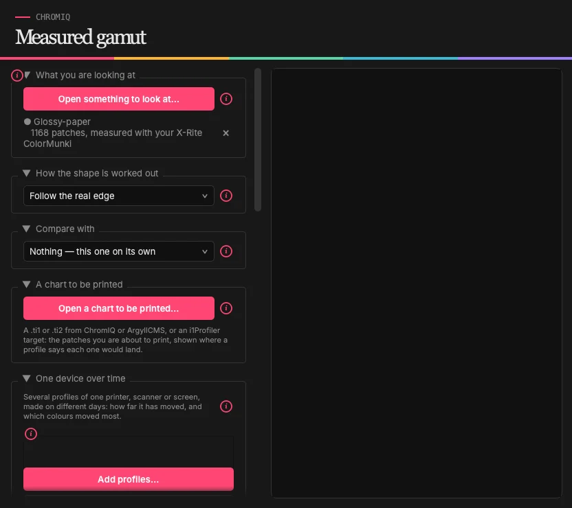

Underneath the volume you also get the two numbers that decide how much
contrast the paper can give you: **how dark the blacks reach, and how bright
the paper white is.** A paper that cannot go dark loses shadow detail no matter
how large its volume is.

> On the demo chart above: 1,168 patches, 702,327 cubic Lab units, blacks
> reaching L\* 4 against a paper white of L\* 94.

The volume on its own does not mean much — it is for **comparing** two papers
measured the same way. Everything below is a comparison.

**"Measured the same way" includes how many patches you printed**, and it is
worth a number. A shape is a mesh through the colours you measured, so it sits
just inside the real surface, and it sits further inside the fewer patches you
have. Measured on a shape whose true volume is known exactly — an ellipsoid,
sampled the way a chart samples a paper:

| patches | volume | against the truth |
|---|---|---|
| 400 | 329,066 | −3.0% |
| 800 | 334,336 | −1.5% |
| 1,600 | 336,682 | −0.8% |
| 3,000 | 337,937 | −0.4% |
| 20,000 | 339,089 | −0.06% |

So **a 400-patch chart and a 1,600-patch chart of the same paper differ by
2.3%** — and always in the same direction, making the bigger chart look like
the bigger gamut. Two papers are comparable when their charts are the same
size; a 2% difference between charts of different sizes is the counting, not
the paper.

### 2. Will the photos people send me survive on this paper?

Set **Compare with** to **sRGB** — what most photographs and most screens
assume. The comparison is drawn as an outline around your paper, and you get
coverage **in both directions**.

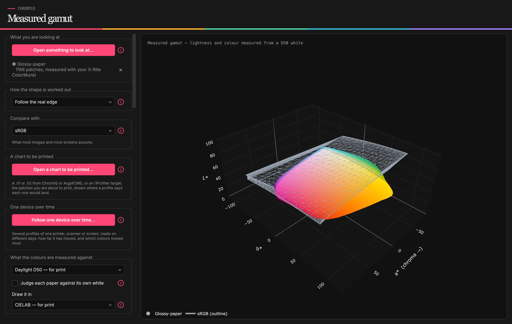

Both directions, because they answer different questions and are rarely the
same number:

> 75.9% of what this paper can print also fits inside sRGB.
> 64.3% of sRGB fits inside this paper.

The first says how much of your paper an sRGB workflow can even address. The
second says how much of an incoming sRGB image your paper can reproduce. A
single "similarity" figure would hide exactly that difference.

To see **where** the colour is lost rather than how much, tick **Show what the comparison cannot print**. Everything the comparison cannot reach turns
warm red against muted grey:

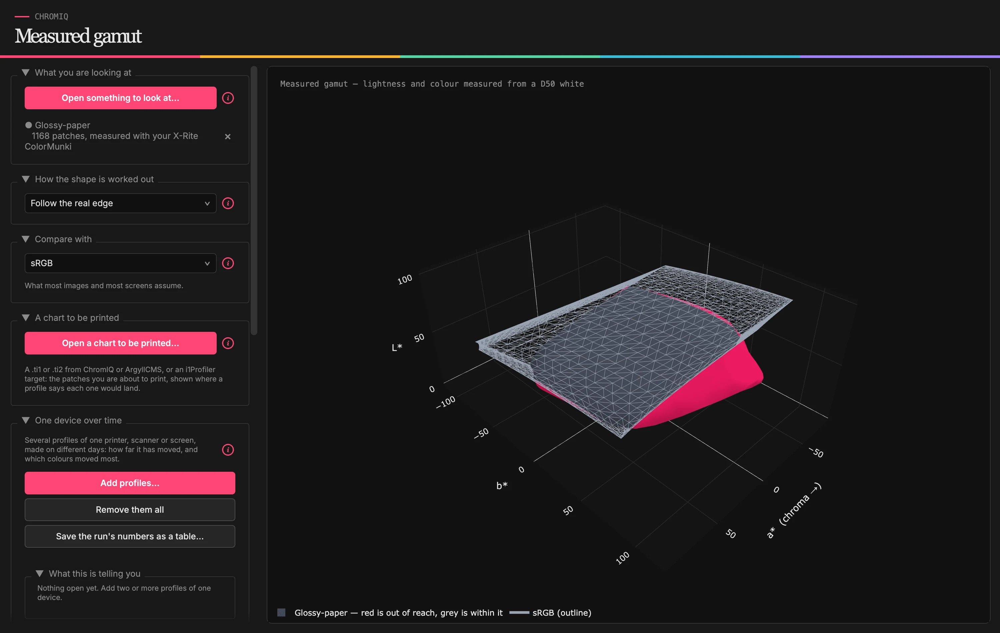

You can compare against sRGB, Adobe RGB, Display P3, ProPhoto RGB, Rec. 2020,
any ICC profile on your computer, or **everything the eye can see** — the
theoretical limit for a surface colour under that light. No printer comes close
to the last one, and that is normal.

### 3. Which of my two papers should I use?

Open a second chart and both are drawn together. Three separate figures appear,
because "which is better" is really three questions:

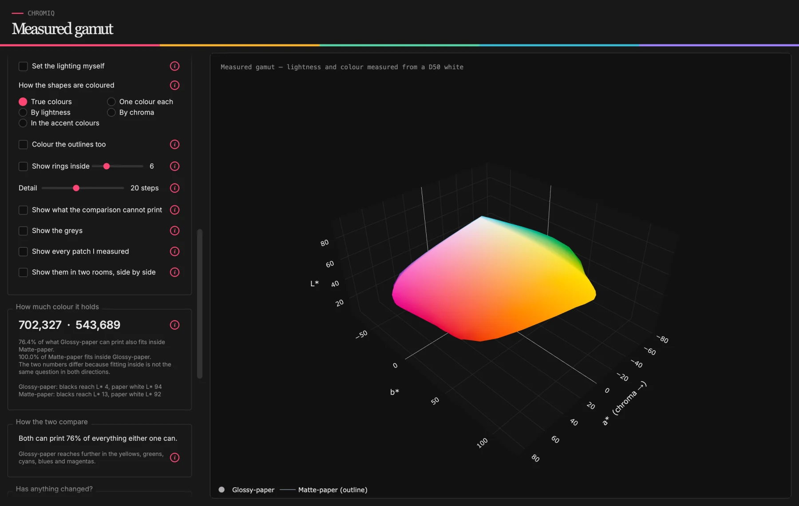

- **Does one fit inside the other?** Coverage, both ways round.
- **How alike are they?** *Both can print 77% of everything either one can.*
  Unlike coverage this is the same number whichever way you ask it, so it
  answers "are these two the same paper, really?"
- **Where does each one win?** *Glossy-paper reaches further in the yellows,
  greens, cyans, blues and magentas.* This is usually the decision: a paper
  that reaches further in the cyans and blues suits skies and water, one that
  reaches further in the yellows and reds suits skin and autumn.

A hue family is only called a win when it is more than 2 chroma units clear.
Smaller than that is neither visible nor worth trusting, and announcing it
would let the readout contradict itself.

- **And what colour is the paper itself?** *Glossy-paper: blacks reach L\* 4,
  paper white L\* 94 and cool (a\* −0.4, b\* −3.4).* Every other figure here is
  blind to this. Volume barely moves when a white shifts, and coverage only
  counts colours in or out — so two papers can read as near enough the same
  while one is a cool, brightened white and the other a warm cream. That is
  visible on every print, in every neutral, before you look at a saturated
  colour at all, and it is the difference the M0 / M1 / M2 measurement
  conditions exist for. The demo papers differ by 4.5 in b\*, and nothing else
  in the window said so.

### 4. Has my printer changed since last time?

Open two readings of the **same** chart. As well as the shapes, you get a
patch-by-patch comparison in ΔE2000 — the modern colour-difference measure.

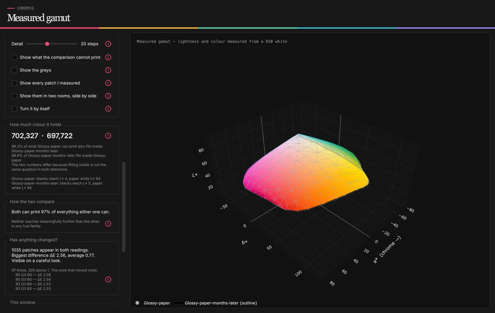

> 1,035 patches appear in both readings.
> Biggest difference ΔE 2.56, average 0.77.
> Visible on a careful look.
> …and the individual patches that moved most, named by their device values.

Patches are matched on the **device values** rather than the patch number,
because charts are randomised and the same colour rarely carries the same
number twice. If fewer than half the patches appear in both files, it says
these are not two readings of one chart instead of producing a confident
figure that describes nothing.

### 5. Does my ICC profile match what my printer really did?

Open your measured chart, then set **Compare with** to **An ICC profile on my
computer…** and pick the profile built from it.

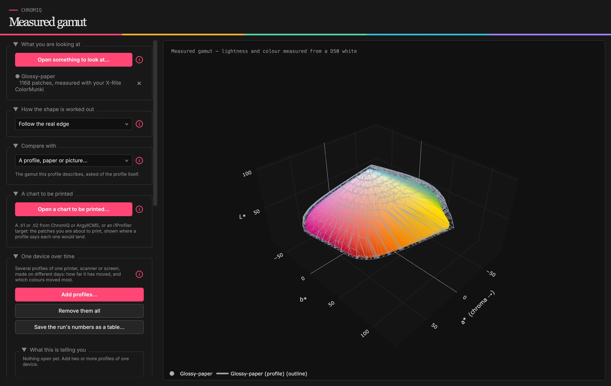

A profile that bulges well outside the measured cloud is over-promising; one
that sits well inside is leaving gamut on the table. On the demo chart and the
profile built from it:

> 96.4% of what the measurement can print also fits inside the profile.
> 82.6% of the profile fits inside the measurement.

The profile is always labelled **(profile)** in the figures, so a profile and
the chart it was built from — which usually share a name — can never be
confused for each other.

ICC profiles are read through ArgyllCMS's own `iccgamut` when it is installed,
so the shape is the one ArgyllCMS itself would draw.

### 6. Are my greys actually grey?

Tick **Show the greys**. The neutral axis is drawn through the solid, and every
grey patch is marked with how far it has drifted from neutral.

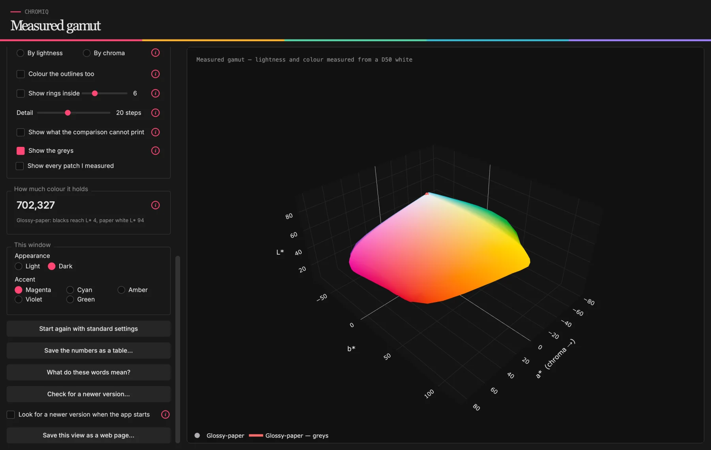

A colour cast in the greys is the thing viewers notice first in a black and
white print, and it is invisible in the overall shape.

### 7. Will the chart I am about to print actually fit?

This one is about a file you have **not** printed yet. A `.ti1` or `.ti2` — or
the `.txt` or `.pxf` file i1Profiler saves for a target — is a list of ink
amounts about to be asked for. Nothing in it has been printed and nothing
measured, so there is no shape to draw: click **Open a chart to be printed…**,
choose the ICC profile the chart was built for under **Placed through**, and
the patches appear as a cloud of dots, put where that profile says each one
would land.

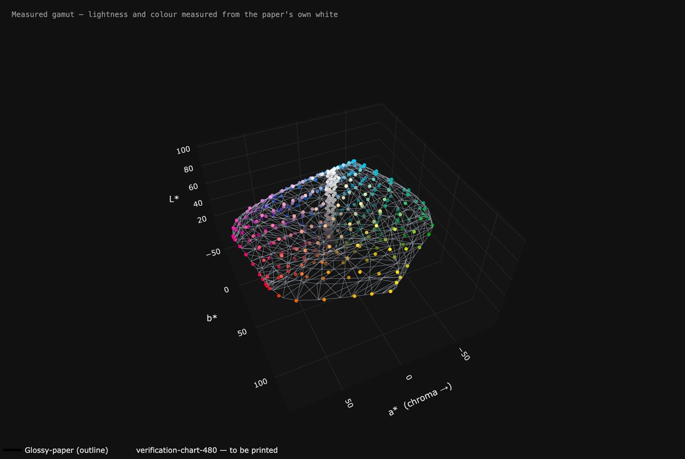

> 480 patches placed through the glossy paper's profile, against the
> measurement of that same paper: **287 inside, 193 on the edge, 0 outside.**
> Everything this chart asks for is a colour the paper really achieved.

Now the same chart, the same profile, and a **different paper**:

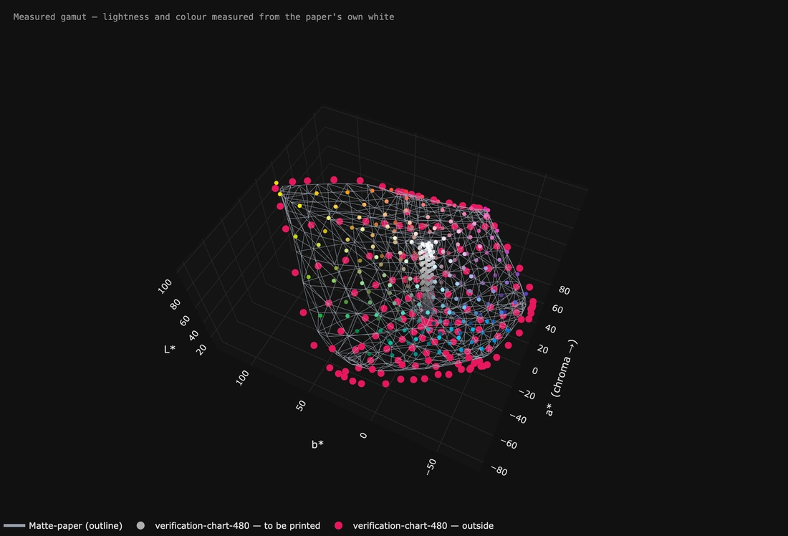

> **204 inside, 98 on the edge, 178 outside**, the worst by 8.9 ΔE. Print this
> chart on the matte paper and a third of it asks for colours that paper cannot
> make. The ones outside are picked out on the picture, and **Save the numbers
> as a table** writes one line for each — including *where it sits on the
> sheet*, when the chart is a `.ti2`.

**Inside, on the edge, outside — three counts, and the middle one matters.** A
gamut surface is worked out from a grid of samples, and between them the real
boundary bulges out a little further than the shape drawn through them. So a
handful of patches always land a whisker outside any surface, including the
surface of the profile that placed them. Anything within **1 ΔE** — closer than
anyone can see with the two side by side — is counted as *on the edge* rather
than outside.

**Judge both against the same white.** A chart is placed relative to the
paper's white, so tick **Judge each paper against its own white** when you
compare it with a measurement. Without it, the profile's L\* 100 white floats
above the measured shape and the light patches are reported outside for no
reason to do with your printer — on the demo paper, 624 of them. The panel
notices and says so, and leaves the tick box to you.

**Which question you are asking depends on what else is open.** With the
profile the chart was built *from*, the answer checks the chart builder, not
your printer, and the panel says so in those words. With the **measurement** of
the paper, it checks the printer — that is the one that finds trouble. Both
appear at once, one line each, so neither can be mistaken for the other.

---

## Reading the picture

### Or give each one a room of its own

Two shapes in one picture shows where one reaches past the other. It is the
wrong way to judge either on its own, though — the shape in front hides the
one behind, and whichever is drawn on top looks bigger than it is.

Tick **Show them in two rooms, side by side** and each gets its own scene:

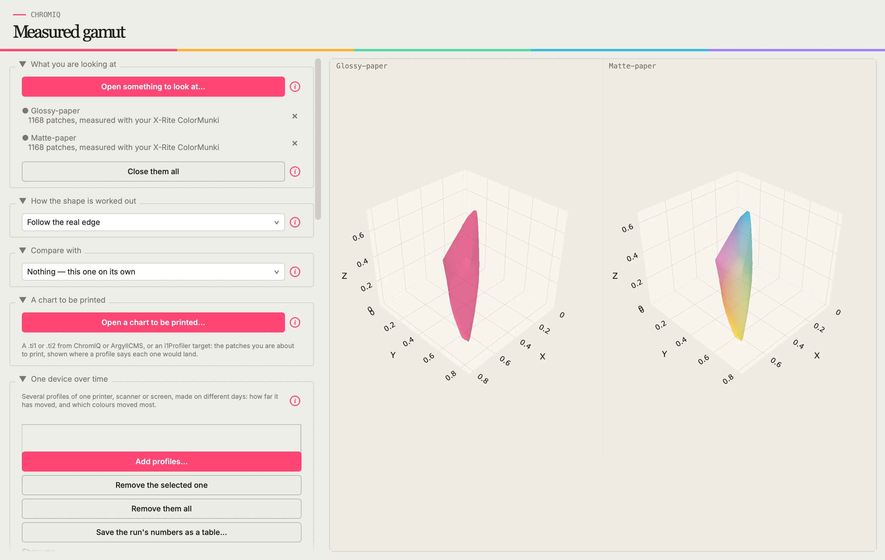

Turn one and the other turns with it, so you are always comparing the same
face of both — that is what makes two rooms worth having. Untick **Both rooms point the same way** to move each on its own.

### Tint it into the accent

**How the shapes are coloured → In the accent colours** paints the gamut in
the colour family the rest of the window uses. Each point keeps its own
lightness, so the shape still reads as a shape; only the palette changes.

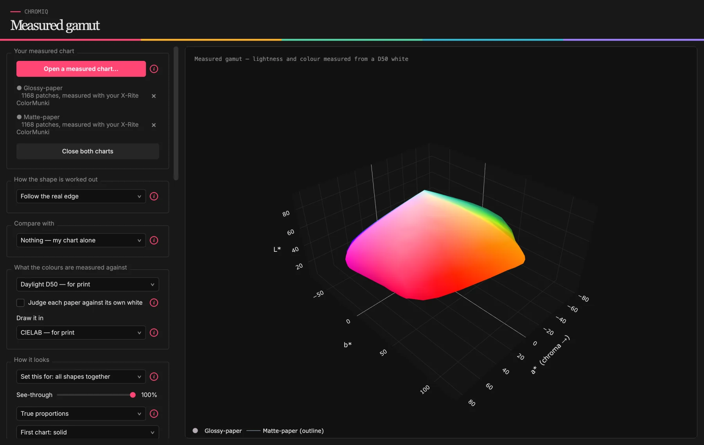

### Turn it, or cut it open

The 3D view can be spun, zoomed and panned with the mouse. When two shapes
overlap they hide each other, so **Slice it at one lightness** cuts both at the
same height and turns the comparison into two flat outlines, where "this one
reaches further into the cyans" is simply visible:

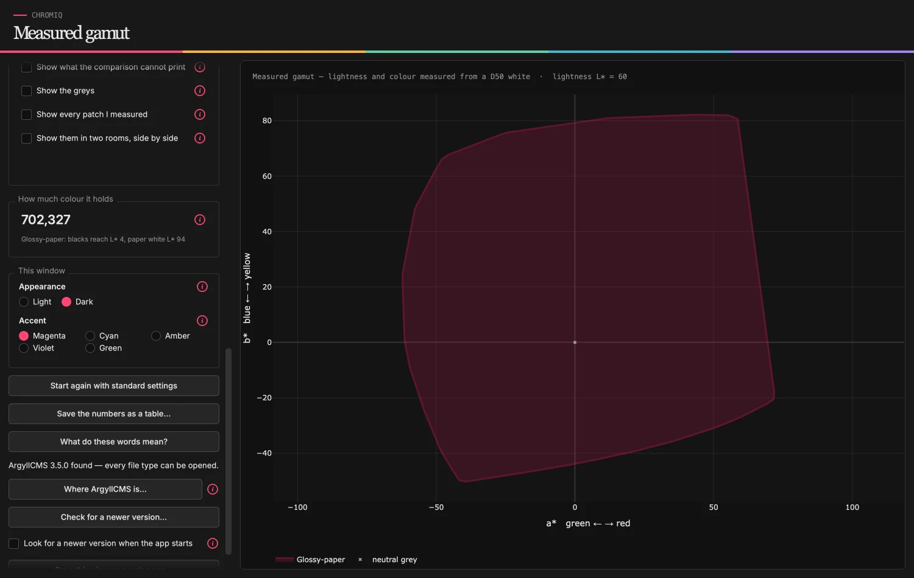

**Show rings inside** stacks cross-sections within the cage, which is what
shows whether your mid-tones or your highlights are the tight part.

### Closing the hole the fade leaves

*Where they agree* fades away the part both shapes reach, and what is left of
the front shape is an open shell: the fade parts it along the curve where the
two surfaces cross, so you are looking in through the opening at that shape's
own far wall. **Close where it is cut** puts a lid over the opening, built
from the other shape's surface rather than a flat plane — the hole is the
shape of the other gamut, and only that shape closes it without bulging out
through the surface or sinking away from it.

It is off unless you ask for it, and the tick dims itself wherever there is
nothing to close rather than accepting a click and answering with nothing: it
wants two shapes, *Where they agree* below full, and at least one of the two
drawn as a surface. A cross-section, two rooms, a run of profiles, or a
picture marking out-of-reach colours is a different construction, and the tick
says which one is in the way. A saved page carries the lid and fades it with
the shape it closes, exactly as the window does — the lid is the wall of what
stands out, so it goes when that does.

### Every shape, styled its own way

**Set this for** aims the appearance controls at *all shapes together*, the
*first chart*, the *second chart*, or the *comparison*. So you can leave one
paper as a solid and show the other as an outline over it, each with its own
opacity, colouring and depth.

**Outline colour** is a separate choice from how the shapes themselves are
coloured, which makes one picture worth knowing about possible: set *How the
shapes are coloured* to **By lightness**, so the solid drains to grey and its
form is what you see, and set the outline to **true colours** — the cage over
it still carries the colour each point really is.

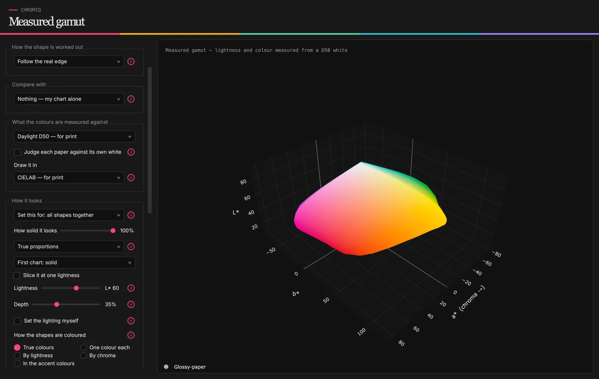

Every setting has an **ⓘ** beside it. Hover for a one-line answer, click for
the full explanation in a window wide enough to read it. An option that is
hidden takes its ⓘ with it.

### Light and dark

The whole window switches, and the 3D scene switches with it.

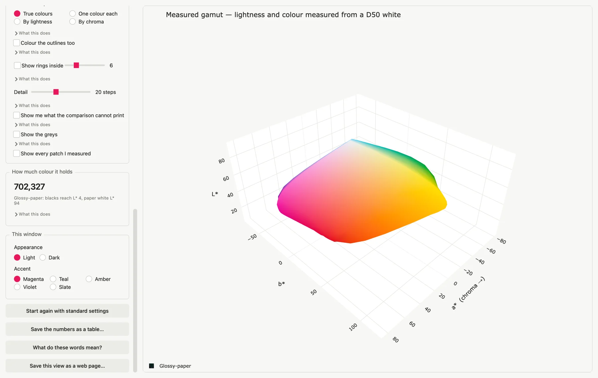

There are five accent colours, four ways of colouring the shapes (true colours,
one colour each, by lightness, by chroma), a Depth slider, and — behind **Set
the lighting myself** — the five individual lighting values if you want to dial
in a particular look.

### Three colour spaces

**Draw it in** offers CIELAB, CIELUV and CIE XYZ. The same paper is a different
shape and a different volume in each:

| | CIELAB | CIELUV | CIE XYZ |
|---|---|---|---|
| | 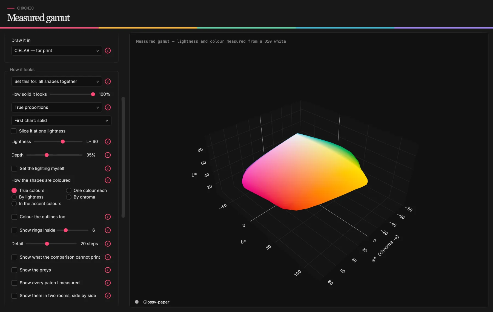 | 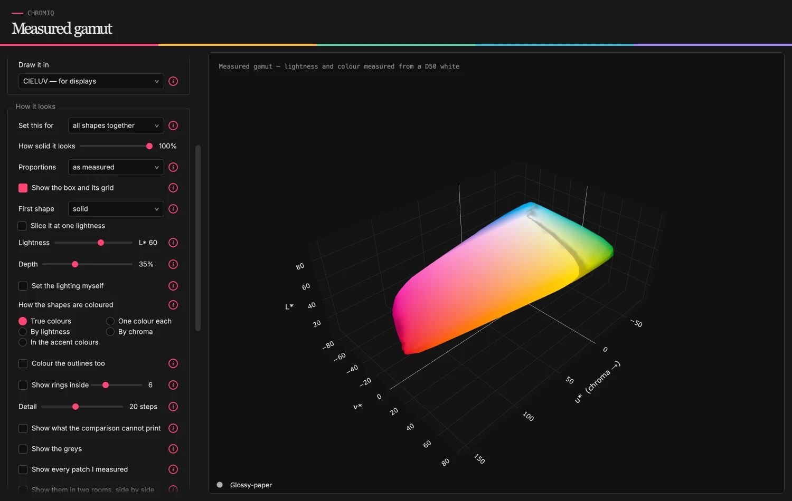 | 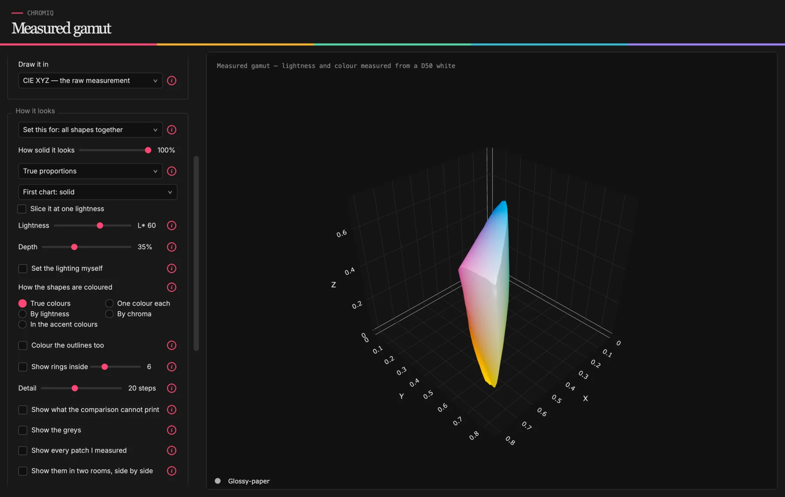 |
| Demo chart | 702,327 cubic Lab units | 931,617 cubic Luv units | 0.0786 cubic XYZ units |
| Good for | **print — the default** | displays and light sources | the raw measurement |

CIELUV has exactly the same lightness as CIELAB and arranges the colour
differently. CIE XYZ is the measurement before anything is done to make
distances match what the eye notices — honest, but hard to read by eye, and it
has no lightness axis and no grey axis, so the slice, the rings and the greys
are switched off while it is chosen rather than drawing something meaningless.

**Volumes and percentages are only comparable within one space.** Changing this
changes every number in the window, and that is expected.

### And one that is not a colour space at all

**Draw it in** has a fourth entry, **Ink amounts — a chart on its own**. Its
three axes are not colour: they are the printer's own controls, how much red,
green and blue ink to lay down, each from 0 to 100. That is exactly what a
`.ti1` or `.ti2` file contains, so **a chart can be looked at here with no
profile, no measurement and no printer** — nothing is predicted, because
nothing needs to be. The numbers on the axes are the numbers in the file.

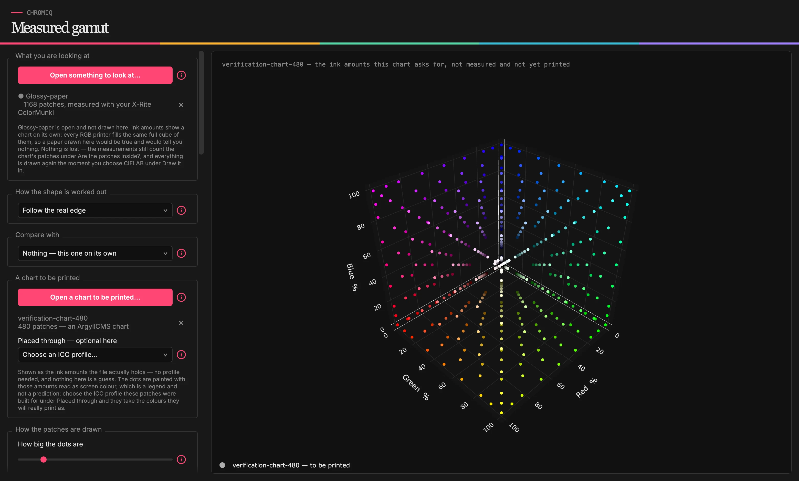

What it answers is a question about **the chart**, not about your printer: how
evenly does this patch set sample the range the printer can be asked for,
where does it crowd, and where does it leave a hole. The spacing figure under
**Are the patches inside?** is quoted in ink amounts here rather than in Lab,
and says so.

**Nothing else is drawn beside it, and that is the point rather than a
shortcoming.** Every RGB printer's boundary *in its own ink amounts* is the
same full cube, on every paper — a paper drawn here would be perfectly true
and would tell you nothing. Papers, profiles and pictures you have open stay
open, keep their measurements, and are drawn again the moment you choose
CIELAB.

**A profile is still worth choosing** under **Placed through**. It cannot move
the dots — the ink amounts *are* the axes — but it is the only thing that can
say what colour each one will come out, so it paints them. And with a paper
open as well, the patches that paper cannot reach are picked out in red, in
ink-amount space:

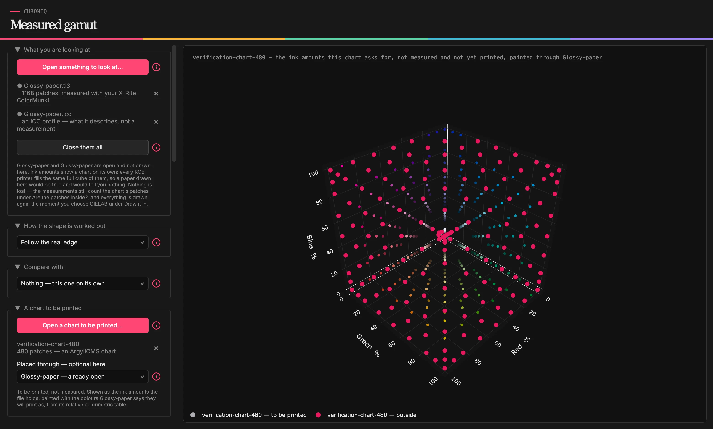

That picture says something the CIELAB one cannot: the losses are the whole
*outer shell* of the ink range, while the interior survives. In CIELAB those
same patches are scattered through the shape and the pattern is invisible.

A CMYK chart has four ink amounts and three axes will not hold them, so it is
not drawn here — dropping the black or folding it into the other three would
draw a chart that was never in the file. The panel says so and sends you to
CIELAB, where a profile can place any number of inks into the three axes
colour has.

### A skin over the patches

A cloud of dots is hard to judge for reach. **How the patches are drawn** puts a
closed surface over them — **Outline only** to start with, which shows the shape
without hiding anything inside it, then **Mesh** or **Solid** with its own
colour and opacity.

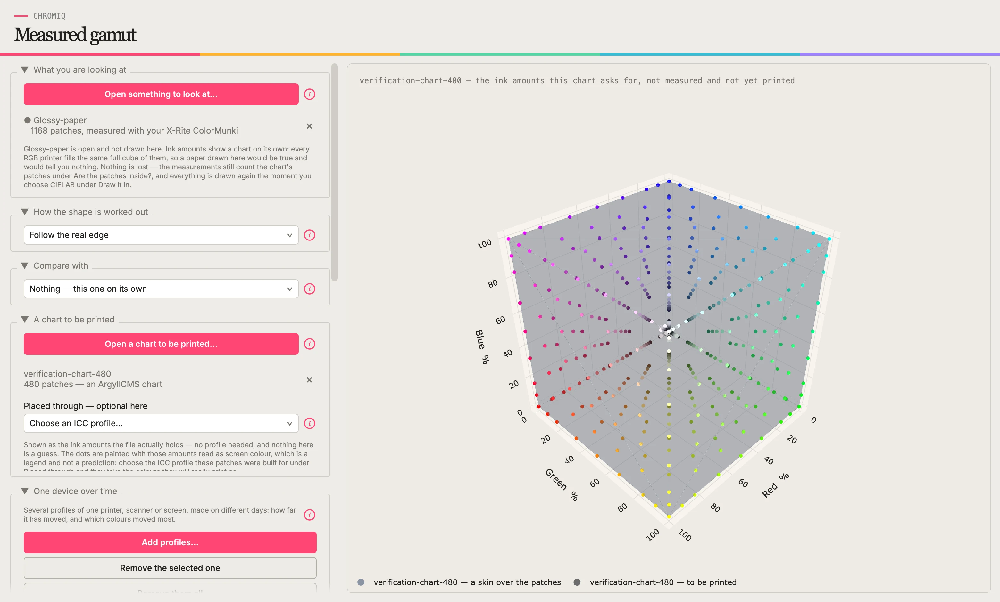

**It is not a gamut, and the window is careful never to let it become one.** A
gamut is the boundary of everything a paper can print. This is a skin over the
patches *one chart happens to ask for*, and a chart only samples wherever its
author put a patch. On the demo files the skin comes out **8% smaller** than the
paper's own measured gamut — 663,257 against 724,277 cubic Lab units — purely
because the chart puts no patch on some parts of the boundary. So it never joins
**How much colour it holds**, never joins a comparison, and is labelled *a skin
over the patches* in the legend.

**With a paper open the skin covers only the patches that paper can reach.**
There is deliberately no skin over the ones out of reach, and the reason is
measured rather than aesthetic: those patches are the furthest out, so they
*wrap around* the rest. On the demo chart a shape drawn round them comes to
**100%** of a shape drawn round the whole chart — it would fill the picture
entirely and read as "all of this is lost" on a chart where a third of it is.
There is no honest shape for a set of points that surrounds another set, so none
is offered.

A chart whose patches all lie on one plane — a grey ramp, a single hue sweep —
encloses no solid, so no skin is drawn for it.

### Why the zero lines sometimes meet and sometimes do not

A fair question about the grid on the three walls. The lines marking **zero** are
drawn brighter than the rest, and whether they join up depends entirely on
whether zero is *inside* that axis's range or *at the end* of it.

| | range on the demo paper | where zero falls |
|---|---|---|
| a\* | −78.96 … 82.11 | **inside** — the line crosses the middle of the wall |
| b\* | −72.50 … 117.21 | **inside** — same |
| L\* | 3.92 … 93.83 | **outside the range** — no zero line is drawn at all |

So in CIELAB you see the a\* and b\* zero lines cross in the middle of the floor,
and nothing horizontal meets them on the vertical walls — because a real paper's
blackest patch is L\* 3.92 and the axis simply never reaches L\* 0.

In **ink amounts** every axis runs 0 to 100, so zero is at the *end* of all
three. Each zero line lands on an edge of the box and they all meet at the same
near corner — which is why those axes look like they share one source.

**The hairline gap** you can see along some of those edges is the two walls each
drawing their own zero line for the same edge: Plotly sets each wall a fraction
outside the data box, so the two lines run side by side instead of on top of one
another. Nothing is misaligned and no number is affected — it is two correct
lines at almost the same place. Untick **Show the box and its grid** and all of
it goes, walls and numbers included.

### Every word explained

Anything that might be jargon has a plain-language entry under **What do these
words mean?** — fifteen of them, covering every such term the window can show.

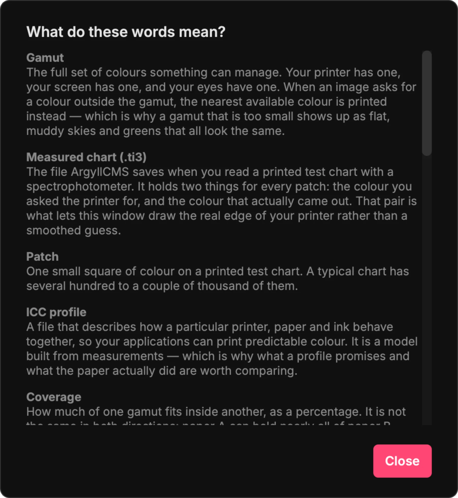

---

## What it opens

| File | What it is | How it is read |
|---|---|---|
| `.ti3` | an ArgyllCMS or ChromIQ chart measurement | directly |
| `.cxf`, `.mxf` | X-Rite's measurement exchange formats | converted with ArgyllCMS `cxf2ti3` |
| `.txt` | a measurement table ArgyllCMS understands | converted with ArgyllCMS `txt2ti3` |
| `.icc`, `.icm` | an ICC profile — open it on its own, or use it as the comparison | ArgyllCMS `iccgamut`, or read directly if it declines |
| `.gam` | an ArgyllCMS gamut file | directly |
| `.ti1`, `.ti2` | a chart **waiting to be printed** — patches, not measurements | directly, and placed through a profile you choose |
| `.txt`, `.pxf` | an i1Profiler target — the same thing, i1Profiler's way | directly; ArgyllCMS cannot convert these, because there is nothing measured in them to convert |
| pictures | a photograph or anything else you can open | through its own colour profile, or sRGB when it carries none |

Converted copies are written to a temporary folder, **never beside your
original** — opening a file to look at it should not leave new files in your
measurement folder.

### Any of four kinds of file, in either place

**Open something to look at…** shows you the file you opened, whichever kind it
is. You can start with a profile and never open a measurement at all. Open a
second and the two are drawn together. A **chart** opened here goes to its own
section — see [what it is for](#7-will-the-chart-i-am-about-to-print-actually-fit)
— because it is drawn as a cloud of dots rather than as a shape.

**A picture can be one of them too** — a photograph, or anything else you can
open. What is drawn is *the colours actually in that picture*, not the space it
was saved in, and the difference is the whole point. Open one beside a paper
you have measured and the readouts answer the real question — and it is worth
knowing that there are **two** answers, because they come apart badly.

**92.7%** of the *space* a Display P3 photograph's colours occupy fits inside
the demo paper. But **38% of the photograph itself** is out of reach, counting
how much of the picture each colour actually covers. Both are true. Most of the
space inside a gamut is unsaturated middle colour that any paper reaches
easily, while a photograph's pixels crowd towards the edges — so reading the
first as "93% of my picture will print" is out by a factor of five, in the
comforting direction. The window shows both, and says which is which.

Tick **Show what the comparison cannot print** and the parts that reach past
the paper are painted on the shape itself — always the deep saturated corners,
which is what a camera catches and a paper cannot.

<p align="center">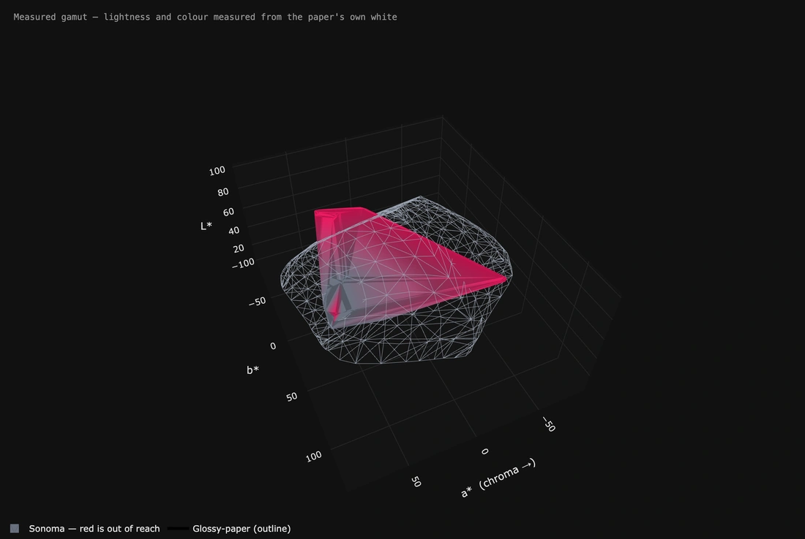</p>

Open the photograph **first** and the measurement second: the painting shows
the first shape against the second, and the other way round paints the paper
against the photograph, which is true and answers nothing anybody asked.

A picture is read through its own colour profile when it carries one. When it
does not, sRGB is assumed — the usual convention — and the line under its name
says **read as sRGB**, because an assumption that changes the answer should
never be made quietly. JPEG, PNG, TIFF, WebP, AVIF, HEIC, JPEG XL, BMP, GIF
and JPEG 2000 all open; the list is asked of your own machine, so nothing is
offered that would fail.

**Compare with → A profile, paper or picture…** puts a third shape beside them,
and takes any of those kinds — so you can hold a paper up against another
paper's measurement as readily as against a profile, a photograph, sRGB or
everything the eye can see.

Every open file says underneath which kind it is. That distinction is the
point of the whole application, so a profile is never quietly called a
measurement: a *chart* is the sheet of patches you print, a *measurement* is
what your instrument made of it, and a *profile* is the fitted model built
afterwards.

The file dialog puts the places profiles actually live one click away — the
ColorSync folders on macOS, the colour folder on Windows including your own
under AppData, and the ICC folders on Linux. A folder holding nothing is not
offered.

### ICC version 4

Both versions open. ArgyllCMS reads version 2 thoroughly and version 4 only in
part, and declines a v4 profile outright — which matters, because v4 is not
exotic: **Display P3, Rec. 709, Rec. 2020 and ROMM RGB all ship with macOS as
v4**, and paper makers hand out v4 output profiles.

So when ArgyllCMS turns a profile down, the viewer reads it itself: it works
out where a dense grid of device values lands using the profile's own numbers,
and builds the boundary from that — the same way it treats a measured chart.
Matrix-and-curve profiles (every RGB working space, and every v4 display
profile) and lookup-table profiles (printers and presses) are both handled.

**It is checked against ArgyllCMS rather than against itself**, and in two
separate ways, because two different claims are being made.

**Reading the profile is exact.** Nothing in an ICC profile is open to
interpretation: given a device value, the matrix, the curves and the tables in
the file determine the colour. Fed the same values, this and ArgyllCMS's own
`icclu` return the same colour to a worst **ΔE of 0.000002** — which is that
tool's printing precision, not a real difference. If the two ever disagreed
about a colour, one of them would simply be wrong.

**A gamut is not in the file, and that is where the small difference lives.**
The file describes a *mapping* from device values to colours. A gamut is the
*boundary of everything that mapping can reach* — and finding a boundary means
sampling the mapping, which the specification says nothing about, because it is
not part of the format. ArgyllCMS samples on its own grid and builds a surface
its own way; this samples a 17-step grid per channel and follows the device
cube's faces. So the volumes land a median of **0.2%** apart, worst **0.9%**,
and always slightly *under* ArgyllCMS's — exactly what a sampled boundary does,
since it is inscribed in the true one.

Both tests live in `python/test_references.py` and run against whatever
profiles your own machine carries.

**One number is worth knowing about.** The specification fixes the connection
space's white as three exact numbers — 0.964203, 1.0, 0.824905 — which is not
quite the CIE D50 a colour library hands you (0.96422, 1.0, 0.82521). The Z
differs in the fourth decimal. Using the textbook value left a constant ΔE of
0.0248 against ArgyllCMS on every profile; using the specification's own
constant leaves nothing. It is a small number that decides whether "agrees
with ArgyllCMS" means exactly or approximately.

### Following one device through time

Two profiles of one scanner, made years apart, and the question "has it
drifted?" — that is what **One device over time** is for.

**A gamut comparison cannot answer it, and the reason is worth stating.** Two
profiles can enclose almost exactly the same shape and send the colours *inside*
it to quite different places. Measured on the run in the examples: **0.42%
apart by volume** — the same shape by any measure — while the colours inside
move by **ΔE 3.03**. For an input profile such as a scanner's, the inside is
nearly the whole profile, so the shape is the part that matters least.

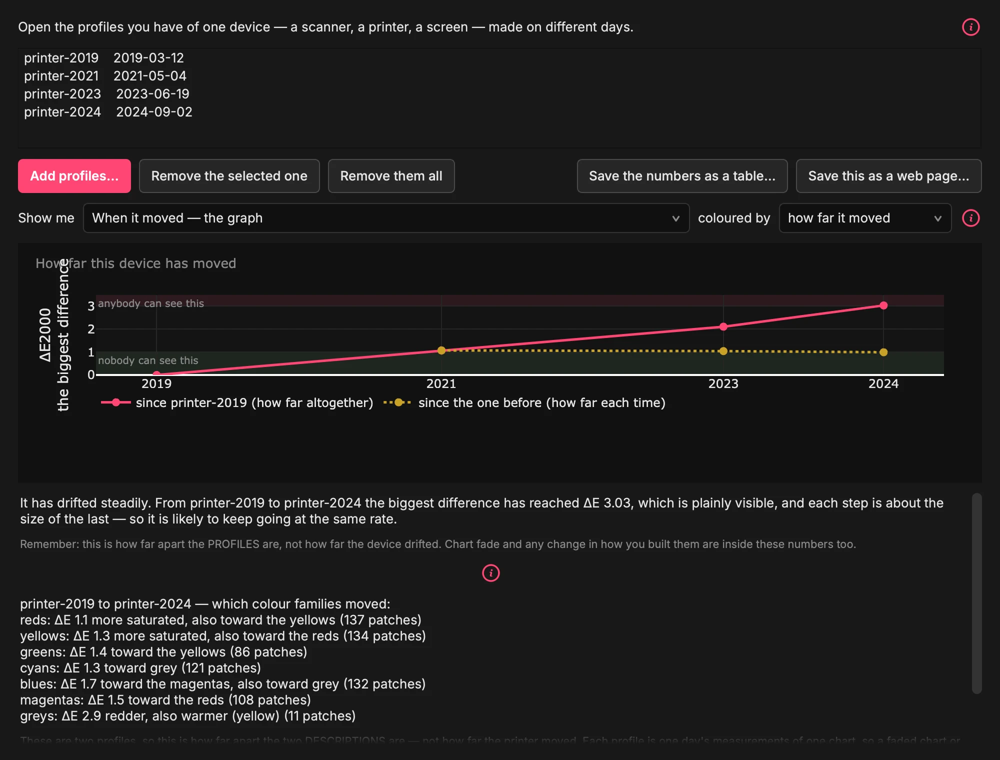

Open two or more profiles of the same device and you get two lines:

* **how far it has moved altogether** since the first profile, and
* **how far it moved since the one before**.

They disagree by design, and both are needed. Five steps of half a ΔE each look
like nothing happening and add up to a difference anybody can see; and a run
whose steps are all the same size means something quite different from one with
a single jump in it. The first will keep creeping. The second already happened,
on a date you can go and look up — so the page names it.

Profiles are put in order by the date inside each one, and the graph is spaced
by real time rather than evenly, because an evenly spaced axis draws a steady
line through a device that was quiet for three years and then moved. If any
profile has no usable date the list keeps the order you added them in and says
so — sorting some by date and guessing at the rest would look authoritative and
be partly invented. Drag a row to put it where you want it.

**What it cannot tell you, and it matters more here than anywhere else in this
program.** Each profile records one day's measurements of one chart. If your
charts faded between them, or you changed how you built them, that is inside
these numbers too. A line that climbs steadily is just as consistent with
charts ageing as with a device drifting, and no arithmetic can separate them.
To measure the device alone you need a chart you trust not to have changed.
That sentence is saved into the page along with the graph, because a graph
outlives the window that explained it.

**And from the graph, straight to any step of it.** A line says *when* a device
moved. It cannot say *where in colour* it moved — and those want opposite
actions, because a device that has drifted evenly everywhere is a calibration
job while one that has moved only in the deep blues is a different problem
altogether. Both draw exactly the same line.

So **Show me** offers the graph, then every step of the run by name — *Where it
moved — printer-2019 → printer-2021 (ΔE 1.07)* — and the whole run first to
last. Choose one and the graph is replaced by the heat-map for that pair: every
colour drawn where the earlier profile puts it, painted by how far the later one
sends it instead. The picture names the pair it is showing, so a screenshot of
it is still about something. **Save this run as a web page…** writes whichever of
the two you are looking at, rather than always the graph.

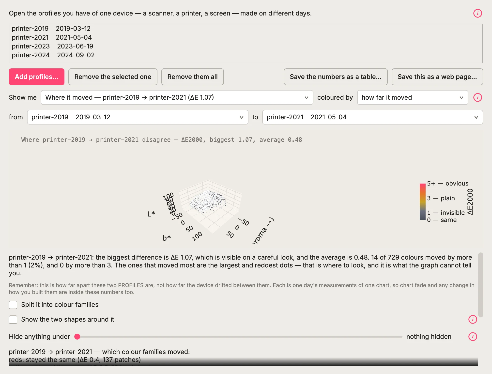

The sentence under the picture follows the picture: it is about **that pair**,
not about the run. Here the step from 2019 to 2021 is ΔE 1.07 at its worst and
0.48 on average — 14 of 729 colours moved by more than 1, none by more than 3 —
so the cloud is honestly pale. A small drift *looks* small, because the colour
scale is fixed rather than stretched to fit.

**Any two, not only neighbours.** The steps are shortcuts, because they are the
pairs people reach for most — the graph jumped between these two, so where did
it go? Underneath them, **from** and **to** hold whichever two you like: the
profile from before a head clean and the one six months later need not sit next
to each other in the run. Picking a step fills those boxes in; changing them by
hand switches the chooser to *any two you choose*. Choosing the first entry
again puts the whole graph back.

**Two at a time, and only two.** Every dot is painted by how far apart *two*
profiles put that one colour; a third would need a second colour on the same
dot, and there is nowhere to put it — so a cloud of three would have to hide
something or invent something. That is less of a limitation than it sounds,
because a run is made of steps and every step *is* a pair.

**How many profiles can a run hold?** As many as you have. Measured on real
LUT profiles of about 1.3 MB each: **24 of them build in 0.15 s**, six
milliseconds apiece, and it is flat — a hundred hand-written ones take 0.10 s
and hold 8 MB. A professional profiling monthly has twelve a year, so five
years of them is well inside what this does without pausing.

#### Which way it moved, not only how far

ΔE2000 is a **distance**, and a distance has no direction. A printer that has
drifted lighter and one that has drifted darker by the same amount give an
identical number and an identical cloud — and they are different faults with
different cures. Measured on two runs bent the same amount in opposite
directions: worst ΔE **3.51 against 3.70**, average **1.61 against 1.62**, and
mean movements of **+0.67 L\*** and **−0.67 L\***. The distance cannot tell
them apart.

**Coloured by** asks the question the distance cannot, one axis at a time:
*lighter or darker*, *redder or greener*, *warmer or cooler*. The scale runs
both ways from **no change** in the middle, so the two ends are opposite
directions rather than more and less of one thing.

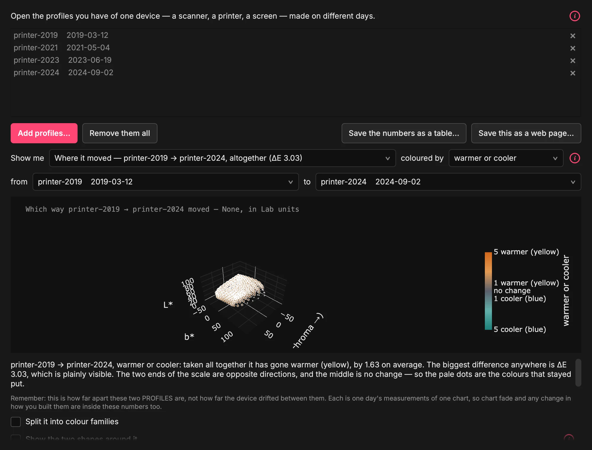

**The dots are deliberately not red and green, or blue and yellow.** In a
picture whose whole subject is colour, painting "went redder" in red invites
you to read a dot's colour as the colour it stands for. One teal-to-orange
scale for all three means the key is learned once and cannot be mistaken for
the thing it describes — and it stays readable with the commonest colour
blindness, which red-green does not.

It needs nothing installed — profiles are read directly.

### Comparing two profiles, colour by colour

The same question asked of exactly two profiles is answered in the main window,
under **Has anything changed?** — the same box that compares two measurements
of one chart, because to you it is one question. **Show me where, in the
picture** then paints every colour where the first profile puts it, coloured by
how far the second sends it instead. The numbers say how much; the picture says
where, which is usually the more useful half.

### Do you need ArgyllCMS?

**Usually not.** Measurements (`.ti3`), gamut files (`.gam`) and ICC profiles
all open without it. It is needed only for `.cxf`, `.mxf` and `.txt`, which it
converts — those formats have corners (spectral tables, several colour
specifications in one file, vendor extensions) and ArgyllCMS already handles
them correctly, so re-implementing that would be a worse answer, not a better
one. For ICC profiles it is *preferred* rather than required, because it works
the surface out in full precision.

**And it never freezes the window while it tries.** Reading a profile happens
on a thread of its own, so the window goes on painting and answering. If it
takes longer than usual — ArgyllCMS is sometimes slow on a profile it does not
care for — a small dialog says which file it is working on and offers **Stop**,
which really ends the tool rather than waiting out the timeout. Measured: an
ordinary profile takes 149 ms and you never see the dialog at all; a stuck one
used to freeze everything for thirty seconds and now leaves the window fully
alive, opening the profile directly when ArgyllCMS gives up.

**Preferred means preferred, in all three ways it can go wrong.** A profile
opens whether ArgyllCMS is missing entirely, present but unable to read the
file — ICC **v4** is the common case, and Display P3, Rec. 709 and Rec. 2020
all ship with macOS as v4 — or present and stuck on it. In each case the
profile is read directly instead, in milliseconds. Measured on the demo
profile, the two readings are **0.76% apart** by volume (818,514 against
824,706): ArgyllCMS returns the surface it computed, with the profile's real
dents in it, which is why it is asked first wherever it exists.

It is found automatically in all the usual places:

* **Where a download lands and stays** — your Downloads, Desktop or Documents
  folder, including the version-numbered folder the official build unpacks
  into (`Argyll_V3.5.0`). Unpacking the zip and leaving it there is enough.
* **Where an installer puts it** — `/Applications` on a Mac, `Program Files`
  on Windows, `/opt` or `/usr/local` on Linux.
* **Homebrew**, which carries it as `argyll-cms` on macOS *and* on Linux, so
  `brew install argyll-cms` is enough on either. A Homebrew moved from its
  default place is followed too.
* **MacPorts**, and a distribution package that puts the tools in `/usr/bin`.

If it is somewhere else entirely, **This window** says so and **Where
ArgyllCMS is…** lets you point at the folder yourself. Choose either the
ArgyllCMS folder or the `bin` folder inside it — both are accepted, and the
right one is worked out for you. The same button opens
[argyllcms.com](https://www.argyllcms.com/) if you have not got it — it is
free, and it is the same toolkit that reads a printed chart in the first
place. Nothing nags you about it on startup, because most people never need
it.

If it is not found, the message names the folders it looked in, so you can see
at a glance whether the place you installed it was among them.

### The blacks a dark page hides, and the whites a light one hides

The shape is painted the colour each point really is. The page it is drawn on
is a colour too, and at one end of the shape the two can be the same colour.

On the dark page, the glossy demo paper's darkest eighth has a mean of
**19, 19, 29** against a page of **17, 17, 17** — 41.9% of that end is drawn
and cannot be seen. The matte paper loses none of it, and matte is the paper
whose blacks are *worse*: L* 12.7 against L* 4.0. Comparing the two on a dark
page shows you more of the poorer paper. A light page does the mirror image and
hides 12.7% of the glossy paper's white instead.

Nothing is repainted — that would be a lie about the print. Instead the window
says so, and names the control that fixes it:

> Glossy-paper's blacks come within 4 levels of the page behind them, so 42% of
> that end is drawn but cannot be seen — and it is the deepest black the paper
> reaches. Under "How the shapes are coloured", choose "By lightness" to see
> it.

The note is worked out against whatever is actually behind the shape, so it
warns about the white on a light page, about the blacks on a dark one, and
about neither on a mid grey. Choose **By lightness** and it disappears.

### See-through shapes are drawn in the right order

A shape drawn solid hides itself; a shape drawn even slightly see-through does
not, because the drawing library turns depth *writing* off for its transparent
pass. Every triangle is blended in — near ones and far ones, in whatever order
they sit in the file — and the last to land on a pixel is the one that mostly
shows. Pieces of the far side punch through the near side as hard-edged
triangles, and the shape reads as torn, sliced, or oddly dark.

Both the window and every saved page now put each see-through surface's
triangles in far-to-near order before drawing. Measured on sixteen different
things this can draw, at six camera angles each, worst angle reported: the
shape itself goes from **88.8% of the picture unlike the solid one to 0.7%**,
and the two fades used for comparing papers go to **0.0%**.

It keeps up while the shape turns — **61 frames a second on every kind of
page**, from a single 978-triangle chart to a 19,230-triangle comparison at
full Detail, and on a page holding two scenes side by side.

### And the depth buffer is given its precision back

That handles the surfaces you can see through. A *solid* surface is drawn by
the depth buffer, which compares distances — and it was being asked to do that
with almost no precision to work with.

The drawing library never sets a near or a far plane, so it falls back to
0.01 and 1000: a hundred-thousand-to-one range over a picture the size of a
unit cube. Depth precision is spent nearest the eye, so nearly all of it lands
in the empty space in front of the shapes. **On the sixteen-bit depth buffer
this machine reports, one step of depth then comes out larger than a Lab** at
the distance these shapes are drawn from. Two surfaces closer together than
that cannot be told apart at all, and the picture hatches with fine diagonal
stripes wherever they run close — most visibly along the seam where a lid
meets the skin it closes, which is why **Close where it is cut** was held back.

Every page this application writes now fits those two planes to the box the
camera actually sees, as you turn it. Measured on a real page at four camera
angles, counting only the speckle the lid itself adds:

| | before | after |
|---|---|---|
| as saved | 121 | **10** |
| angled | 158 | **24** |
| from above | 193 | **16** |
| from below | 34 | **27** |

All four are improved. The last one was for a while *worse* than leaving the
planes alone — 34 against 132 — and the cause turned out to be a floor: the
near plane was clamped no closer than 0.001, ten times closer than the drawing
library's own 0.01, and depth precision is proportional to it. Wherever that
clamp bit, the fix was handing the buffer less precision than doing nothing
would have. The floor is now the library's own number, which is what makes the
fitted planes unable to be worse than not fitting at all.

These counts are taken below the toolbar. Its icons speckle exactly the way a
hatched seam does, and while they were in frame they were being counted as
part of the picture.

Nothing is clipped by the closer planes. Every corner of the drawn box sits
between them from twelve camera angles, including ones inside the shape, with
room to spare — and the axis box, its grid walls and every tick label survive
in the pictures themselves.

That last check is worth describing, because the obvious way to make it says
the opposite. Counting *pixels the library drew that the fitted planes do not*
comes back with a few hundred at some angles, which reads as damage. Looking at
them, they are not: at one angle every one of them has the same line still
drawn a pixel away — the line moved, it did not go. At another, a segment of an
axis line was **brighter than the rest of the same line**, 70 against 20,
because with no depth precision an edge on the far side of the box was showing
through the near side; fitted, that segment matches its own line and the count
calls its removal damage. Nothing coloured is ever lost, and the whole picture
is there both ways.

⚠ **Nothing in the drawing library is modified.** It is a script of this
application's own, written into its own pages, which sets two numbers after the
library has drawn. A page saved *without* the viewer inside it — the small one,
which fetches the viewer when its reader opens it — carries that script too and
was checked in a real browser fetching a real viewer.

### Two shapes that cross are drawn right as well

Ordering each shape's own triangles fixes each shape. It could not fix two of
them against each other, because the library draws one whole surface and then
the next, and two gamuts of the same printer are not one in front of the other
— they pass *through* each other. Whichever goes down first is wrong over half
the picture, and there is no order of two surfaces that is right.

So they are no longer drawn as two. Every see-through surface in a picture is
handed to **one** drawn object each frame and sorted as a single pool of
triangles, all of them far-to-near. The page still holds two shapes — the key,
the hover, the visibility switches and the saved file are untouched — but the
graphics card is given one correctly ordered surface.

What "right" means here is not a matter of taste. Weld the shapes into a single
surface before the page is written and the question disappears, and that weld
is the reference. It was checked before it was believed: welding the other way
round moves the picture by 0.00%, and at a thousandth of transparency it agrees
with the *solid* shape — drawn by the depth buffer, which does no ordering at
all — to 1.0%. Measured against it at eight camera angles:

| | before | each shape alone | one pool |
|---|---|---|---|
| two shapes, both at 0.55 | 76.2% | 68.5% | **0.0%** |
| two shapes, 0.55 and 0.30 | 73.4% | 62.6% | **0.0%** |
| three shapes at 0.55 | 81.5% | 76.3% | **0.0%** |

Two things had to survive the weld, and both do. A **strength per shape**: one
surface has one opacity, so each vertex carries its own shape's strength in its
alpha instead — the same arithmetic the library was doing anyway, done once.
And **which shape the pointer is over**: each shape owns a known stretch of the
pooled surface and answers for its own, so hover still names the right paper.

The one case it declines is shapes **lit differently** — one surface has one
light, and giving it two would be a picture nobody asked for. Those keep the
per-shape ordering, which is the second-best picture rather than a wrong one.

### It moves, and you can take the movement with you

Depth is hard to judge on a flat screen — a dent in the deep blues and a
shadow look alike in a still picture. **Turn it by itself** sets the shape
moving, left and right, up and down, or both at once, and **Save this view as
a picture…** writes that movement out as a file you can drop into a forum
post, a document or a chat window.

Six kinds of file, in two families. **WebP, GIF and APNG** are pictures that
move: they start on their own and repeat for ever with nothing to press —
which is exactly what the loop at the top of this page is. **MP4 (H.264),
MP4 (H.265) and WebM (VP9)** are films: about half the size for the same
sharpness, with a play button. The films are made by ffmpeg, and a copy comes
with the application, so there is nothing to install.

The loop closes exactly — the file holds one complete journey fitted into the
seconds you chose — so it never jumps as it comes round.

**[Seventeen more loops, over seven pages, each at full size and quality →](docs/MOTION.md)**

### Everything around the shape is yours

**Viewer and export styling**, in the left-hand column, decides what a saved
picture looks like: what is behind the shape, what the three walls are, and
what colour the lettering and the grid lines come out. There are ready-made
looks named for where the picture is going — *For a white document*, *For a
dark slide*, *Cut out for a light page* — and the window's own dark and light
are two of them.

Tick **Live preview** and the view in front of you *is* the picture that will
be saved, so setting one up is a matter of looking at it rather than
imagining it. That also makes it a way to have the application itself look
how you like.

Looks you build yourself are saved under a name, as one small file each, in
the same folder ChromIQ keeps its own presets in — so sharing one is sending
somebody a file, and using one they sent is putting it in that folder.
Removing one never deletes it; it moves into an `old` folder with the date on
it.

*(There is [one dressed for a white document](docs/motion/page-4.md) on the
loops pages, so this one stays light to load.)*

### A picture with nothing around it

<p align="center">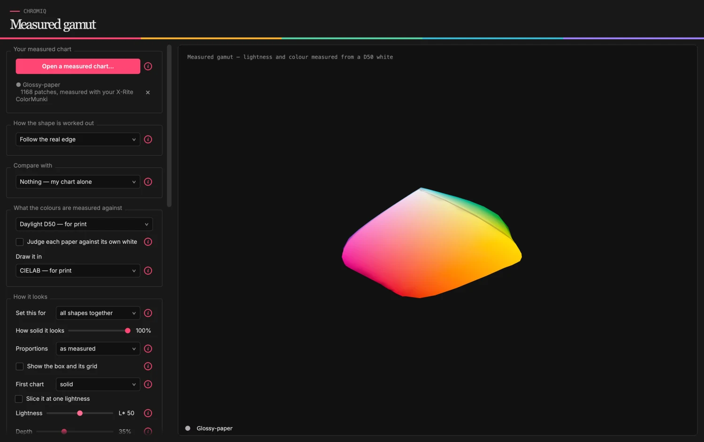</p>

Untick **Show the box and its grid** and the walls, the grid, the numbers and
the axis names all go, leaving the shape floating on the page. Keep them while
you are reading the shape — they are what tell you how light a part of the
surface is — and drop them for a picture going into a document, a slide or a
forum post. It applies to the whole picture, so two rooms lose the box
together and the pair still match.

## What it saves

Three ways of taking something with you, answering three different questions.

| | For | Notes |
|---|---|---|
| **A picture** | showing somebody | still or moving, any size, see-through if you like |
| **A web page** | letting them turn it themselves | carries its viewer, or fetches it and saves 4.7 MB |
| **A table** | doing arithmetic on the numbers | plain CSV |

A **still** is redrawn by the viewer at whatever size you ask for, so it can be
far larger than the window — and for the flat cross-section it can be a real
vector SVG of about 12 kB. A **moving picture** is WebP, GIF or APNG. The
background and the grid's walls are set separately, each able to be a colour of
your own or see-through, so the shape can float on any page you drop it onto.

It says roughly how big the file will be before you make it, and never writes
over a file that is already there.

### A page somebody can turn themselves

**Save this view as a web page…** writes **one self-contained `.html` file** of
about 5 MB. Double-click it and it opens in any browser — and it needs **no
internet at all**, because the 3D viewer travels inside the page. It works from
a memory stick, from an email attachment, on a plane, in ten years.

**[▶ See fourteen of them, live →](https://itsab1989.github.io/ChromIQ-Gamut-Viewer/)**

What the person you send it to gets is not a picture — it is the scene. They
can drag it round, zoom in, click the names underneath to hide and show shapes,
and use the strip under the picture to **start it turning, stop it, change the
speed, zoom in and out, move the picture about, switch the left-and-right and
up-and-down movement on and off, and put the shape back the way it opened**.
That works on every page, including one you saved standing still: it simply
opens with the button reading **Play** and nothing moving until they ask.

**On a phone, one finger turns it and two fingers pinch to zoom or drag it
about.** That is worth spelling out, because it is new and because it was
genuinely impossible before. The viewer that draws these shapes decides
between turning, moving and zooming by *which mouse button is down* — left
turns, right moves, middle zooms — and its touch handler reads a single finger
and reports it as the left button. A phone has no second button and no Ctrl
key, so on a touch screen the only one of the three that could ever happen was
turning: a shape could be spun and never approached. Both gestures are now
handled by the page itself, and the **zoom** buttons and the four arrows
behind **more…** are there for anyone who would rather press something — or
who is on a desktop with no wheel.

<p align="center"></p>

**You choose which controls the page carries**, each time you save it. The
save dialog has a section — *What the person opening it can change* — with a
switch for each one, and an explanation of when it is worth handing over:

<p align="center"></p>

There are twenty-three of them now, in five named groups — *Moving the shape*,
*Looking at it*, *How each shape is drawn*, *What the picture shows* and *The
page itself* — each with an explanation of when it is worth handing over. The
ones that were always there stay ticked, along with **zoom** and **move**,
which are ticked by default because without them a page cannot be read
properly on a phone at all. Everything past Play, speed, zoom and reset lives
behind a **more…** button, so the strip stays short on a phone.

**Each shape on the page gets its own row of controls**, one row per name in
the key underneath — and that is deliberate rather than convenient. A page can
hold a solid surface, a wire cage round a second paper, a cloud of chart
patches and a skin over them, and nobody reading it knows which of those the
code calls a shape. What they can see is the list of names.

| For one shape | What it is for |
|---|---|
| **fainter / more solid** | The front shape hides the back one and no amount of turning fixes it. You pick one strength when you save; this lets them pick a different one for the shape *they* care about. |
| **wires** | A net of fine lines over the surface, following the measured points — so it shows where the measurement is dense and where the shape between two readings is the drawing's guess. Faint at the same time leaves the cage alone, which is the clearest way to show one shape inside another. On a cross-section, the same switch fills the outline in or empties it. |
| **grey** | Two shapes both painted in the colours they hold make a picture nobody can untangle; one of them in grey makes the other obvious. |

The grey keeps the light and dark exactly. Each colour becomes **its own true
brightness**, worked out the way sRGB itself defines brightness — not by
averaging the three numbers, which would make a pure blue and a pure yellow
the same grey when one is nearly black to look at and the other nearly white.

**Some shapes are never offered it, and that is the point.** Where the colour
*is* the measurement — the comparison shape that is red for what a paper
cannot reach, and a chart's out-of-reach patches — a greyed picture would
still carry a name promising two things while showing one. Those are marked in
the file and the switch is not built for them at all. Not built rather than
built and refused: a control that is present and declines to work is the worse
of the two.

**Two shapes can be dissolved into each other.** *Where they agree* fades the
part every shape reaches, leaving only the places they differ — the question
you ask when choosing between two papers. *Where they differ* does the
opposite, leaving the part they have in common — the question you ask when the
same picture has to go out on both and you need to know which colours are safe
on either.

Both are sliders rather than switches, and that was settled by measurement: a
shape lying entirely inside another agrees *everywhere*, so hiding the shared
part outright makes it vanish completely — correct, and indistinguishable from
a fault. Faded, it is still faintly there and explains itself. At the top of
the range neither changes the picture at all, and that is exact rather than
approximate: the fade rides on a per-point alpha inside a single mesh, so full
strength hands back the identical array of colours. Cutting the surface into
two meshes was tried first and measured against the picture as it ships —
**120,481 pixels differed** with the fade at full, because a browser blends
transparent surfaces in the order it draws them.

**If a see-through shape looks sliced, it is the drawing and not the
measurement.** Two things cause it, and measurement says roughly half each.
A closed shape drawn see-through also shows its **far side from the inside**,
whose faces point away from the light — that appears the instant a surface
stops being opaque, and hard-edged structure jumps from 0.54% to 0.71% at a
*thousandth* of transparency, where nothing can yet be blending. The rest
arrives as real blending: a browser composites see-through surfaces in the
order it draws them rather than by which is nearer. Measured on one paper:
0.54% of the inside is hard-edged when solid, 0.71% at a thousandth and 0.90%
at half — and it depends far more on where you stand, from 0.87% seen from
above to **3.47% at the three-quarter angle these pictures open at**.
The silhouette is identical either way (0 pixels lost of 148,518). Turning
the shape solid removes it, and so does pressing **above**. Both the window
and the saved page say so where you meet it.

**Each direction gets a sweep as well as a speed** — how far it swings, in
degrees, with the same limits the window uses. One press past the widest swing
sends it **all the way round**, which is otherwise impossible on a page that
was saved swinging.

**A saved cross-section carries the same lightness slider the window has.**
Without it a cut is frozen at whatever height the sender happened to be
looking at — and “which paper reaches further into the cyans” has a different
answer near the paper white from the one it has in the shadows. The page
cannot work these out for itself, because slicing a gamut needs the whole 3D
shape and a flat page carries none; so every cut the reader can reach is
worked out when the page is saved and travels inside it, 2 L\* apart, about
170 kB on a file that is already several megabytes. The axes stay pinned
across every height, so the outline shrinks and grows as you slide rather than
being rescaled to fit — which is the one thing the view exists to show.

**Four fixed places to look from** — above, front, side, angle — matter more
than they sound. Dragging is how you explore a shape and a poor way to arrive
at a known position: squaring the eye over the top of a gamut by hand takes
several goes and is never quite square, so two people comparing two of your
pages are comparing two different angles without either of them realising.
Pressing the same button on both makes the pictures strictly comparable.

**Full screen** is built only where the browser has it — Safari on an iPhone
offers it for video and nothing else, so there the button is simply absent
rather than present and dead. **Save a picture** writes what is on screen, at
that angle with those faded shapes, as a PNG at twice the size it is drawn;
made by their own browser out of numbers already in the page, with nothing
sent anywhere.

**Five ways of colouring the page**, if you tick *Let them change the page
colours* when you save it. The reader gets one button that moves through them
in turn, and the name of the one they are looking at is written on the button
itself.

<p align="center">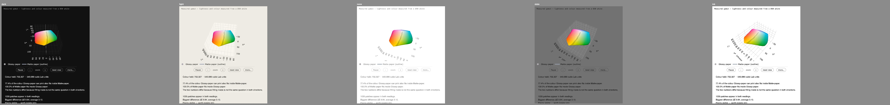</p>

| | What it is for |
|---|---|
| **dark** | What this window itself uses, and what a page opens as unless you saved it light. |
| **light** | The window's light appearance, for a page going next to ordinary black-on-white text. |
| **none** | No background at all: the shape floats on whatever the page is sitting in. This is the one for dropping a picture into a document, a slide or a forum post, where a rectangle of somebody else's grey around it is exactly what you do not want. |
| **slate** | A neutral mid grey — the fairest ground there is to judge a colour against. A gamut on black looks brighter than it really is, and the same gamut on white looks duller; on grey it looks like itself. Neutral is meant literally: every part of it is measured at under half a unit of chroma, because a surround with a cast of its own tints what you are judging. |
| **ink** | Plain black and white, for printing the page or putting it on a projector. A near-black background goes to mud on paper and a warm white goes yellow under a lamp; this avoids both. |

**Not one measured colour changes.** Only the paper behind the shape, the
walls of the box, the grid on them and the writing — and the ground the
written-out figures are printed on, which follows too, so a page switched to
**ink** for printing does not carry a black rectangle across the bottom of it.
A gamut is the same gamut on every one of the five, and the numbers underneath
say the same thing on all of them.

The switch is off by default, because it is not free: saying yes writes the
other four sets of colours into the file, measured at **838 bytes** — nothing
beside a page that is already several megabytes, but not nothing. If you know
the page is going into a white document, save it in **none** and leave the
button off.

**Putting the numbers away** is worth a word. On a small screen the figures
under a picture are easily taller than the screen itself, so the reader gets a
switch for them: pressing it gives the whole window back to the shape, and
pressing it again brings them back. Nothing is recalculated and nothing is
lost.

You can also turn the strip off altogether — for a page going inside a website
beside your own text, where a row of buttons you did not design would look out
of place. The shape can still be dragged, zoomed and its names clicked; only
the buttons go.

**reset view** is the one worth knowing about. It is easy to drag a shape
somewhere you did not mean to, and on a page that arrived by email there is no
obvious way back — it puts the view exactly where the sender left it.

If you ticked **include the numbers** when you saved, they are written under
the picture, on screen, where they can simply be read.

That makes it the right thing for one job in particular: **sending a paper
measurement to somebody who does not have the app** — a printer, a client, a
forum. A picture shows them your angle; this lets them find their own.

**Putting one in a forum post** takes two things, and the app says so when it
saves: a forum will not run a page like this however you paste it in, so post a
**moving picture** for the thread to show, and put a **link** beside it to the
page for anybody who wants to turn it. Most forums take the page as a file
attachment too.

### The numbers, as a table you can hand to somebody

**Save the numbers as a table…** writes an ordinary `.csv` — the kind any
spreadsheet opens by double-clicking, and the kind you can paste into a report
or a forum post. A picture is convincing; a number is quotable, and this is
every number the window is showing you at that moment.

It is worth knowing about even if you never open a spreadsheet, because it
answers the question a picture cannot: *which patches exactly, and by how
much?*

**The top of the file is the summary** — what everything was measured against,
which space it was drawn in, and then one block per thing you have open:

```
what,value,units or note
measured against,D50 absolute,
drawn in,CIELAB — for print,cubic Lab units
Matte-paper: colour held,"543,689",cubic Lab units
Glossy-paper: colour held,"702,327",cubic Lab units
Glossy-paper inside Matte-paper,77.4,"per cent, +/- 0.2"
biggest difference,9.84,dE2000
```

**Then, if a chart is open, every patch that fell outside — one per line.** Not
a count, the patches themselves:

```
outside what,patch number,position on sheet,R,G,B,L*,a*,b*,dE2000 outside
Matte-paper,295,,100.0000,0.0000,0.0000,51.886,78.358,51.727,3.845
```

That line says: patch 295 asks for full red and no green or blue, the profile
puts it at L\* 51.9, and the matte paper misses it by 3.8 ΔE2000. **Position on
sheet** fills in when the chart is a `.ti2` — one that has been laid out for
printing — so you can walk to the printed sheet and look at the patch itself.

Every figure carries its own units in the third column, and nothing is rounded
away: this is the same arithmetic the panel is quoting, written out rather than
summarised. Sort the last column in a spreadsheet and the worst patches come to
the top.


Nothing, unless you ask.

- **Save this view as a web page…** writes one self-contained HTML file. The 3D viewer
  travels inside the page, so it opens in any browser, needs no network, works
  when emailed to somebody, and will still work in five years.
- **Save the numbers as a table…** writes a CSV holding the volumes, both
  coverage directions with their margins, the grey cast, and the drift figures,
  with every row saying what it is and what the units are.

Your settings are remembered automatically and survive a restart — including
which explanations you left open. **Start again with standard settings**
puts every one of them back, and never touches a file of yours.

---

## Where your settings and log live

Your settings are remembered automatically and survive a restart.
**Start again with standard settings** puts every one of them back, and never
touches a file of yours.

There is also a plain-text log, so a fault that happened once can still be
looked at afterwards:

| | |
|---|---|
| macOS | `~/Library/Logs/ChromIQ Gamut Viewer/gamut-viewer.log` |
| Windows | `%LOCALAPPDATA%\ChromIQ Gamut Viewer\logs\` |
| Linux | `$XDG_STATE_HOME/chromiq-gamut-viewer/` |

It never leaves your machine, and it cannot grow beyond **10 MB** — 2 MB a
file, five files kept. You can read or delete it whenever you like.

## Colour science, stated plainly

- **D50 by default**, the ICC connection-space illuminant and what print
  measurement uses. D65 is offered for display work. Lab is computed under
  whichever is chosen, and changing it rebuilds the charts *and* the comparison
  so the two are never in different spaces.
- **The shape follows the printer's real boundary**, not a skin thrown around
  it. A printer's gamut is genuinely dented — most visibly in the deep blues —
  and **Follow the real edge** keeps those dents by using the device values
  every measured chart stores alongside its results. The volume is the volume
  of that dented shape, so the number agrees with the picture instead of
  crediting your printer with colour it cannot print.
- **ΔE is CIEDE2000**, verified against the Sharma, Wu and Dalal (2005)
  reference pairs — the set published specifically to catch the hue-wrap and
  blue-rotation mistakes implementations make. Worst error 0.00004.
- **"Does this colour fit" is asked of the dented surface too**, not just of a
  skin stretched over it. This is worth stating because it was not always
  true: the test used to be membership of the gamut's *convex hull*, which
  fills in every hollow. Adobe RGB's hull holds **6.1% more volume than the
  space does**, and 89.2% of its own surface lies strictly inside it — so
  colours in those hollows were counted as reachable. Every error went the
  same way, flattering the comparison: of the demo paper's 675 boundary
  points, 191 were called outside Adobe RGB where the surface says 239.
- **So is every other question that names a boundary**, which took a second
  pass to finish. A cut through a gamut at one lightness was still outlined
  against the hull, standing outside the real shape in 138 to 159 of every 180
  directions and by as much as **10.05 Lab units**; "both can print N% of
  everything either one can" used hull volumes *and* a hull containment test,
  reading 51.84% where the truth is 50.03%; and a chart patch could be called
  outside by the real surface while the distance beside it was measured to the
  hull, which put one patch at 0.00 ΔE outside. All three now ask the same
  surface as everything else, and the cut is computed exactly — a plane
  crosses a triangle in a straight line — rather than searched for, which made
  it 68× faster as well as right.
- **Where two shapes part company is drawn as an edge, not a slope.** Fading
  the part two gamuts have in common used an alpha per vertex, so any triangle
  with corners on both sides had the difference smeared across its full width
  — 173 of the demo paper's 978 triangles, a fifth of its surface, averaging
  16.5 Lab units across. Both shapes are re-cut along the true crossing curve
  first, so every triangle is wholly one side or the other. It stays a single
  closed mesh; the volume and area are unchanged to seven figures.
- **Sending a saved page to somebody.** It is one self-contained file, so it
  travels like any other: attach it to an email, put it on a memory stick, or
  upload it and send the link. Whoever gets it double-clicks — there is nothing
  to install. **A forum post is the exception**, and deliberately so: forums
  strip web pages out of posts because a page can carry a program, and most
  will not take one as an attachment either. For a forum, put a **picture** in
  the post (**Save this view as a picture…**) and a **link** to the page under
  it — people see what you mean without clicking, and anyone who wants to turn
  the shape can. Choosing **Fetch it when opened** in the save dialog makes the
  file about 4.7 MB smaller, which is the difference between something you can
  upload almost anywhere and something you cannot.
- **Coverage is measured by sampling**, 60,000 points with a fixed seed, so the
  same pair of gamuts always gives the same answer. The points are drawn
  directly from inside the shape rather than thrown at its bounding box and
  sieved, so they are evenly spread through the real volume. The standard
  error is about 0.2 percentage points, which is why nothing is quoted to more
  than one decimal place.
- **"Judge each paper against its own white"** normalises to the media white,
  which is what a relative-colorimetric profile does and what makes two papers
  of different brightness comparable on shape rather than brightness. Off by
  default, so what you see first is what the instrument actually reported.
- **sRGB output is only ever ink for the screen.** Painting a vertex its own
  colour means clipping everything outside sRGB, which is honest for drawing a
  picture and useless as a measurement. It is never treated as a colour value.

A full account of every setting, what it does, where it goes in the code and
why it was chosen is in [`docs/SETTINGS.md`](docs/SETTINGS.md).

---

## Running from source, and the tests

```bash
git clone https://github.com/itsab1989/ChromIQ-Gamut-Viewer.git
cd ChromIQ-Gamut-Viewer/python
python3 -m venv .venv && source .venv/bin/activate
pip install -r requirements.txt
python gamut_app.py                  # the window
python gamut_app.py mychart.ti3      # opening a chart straight away
```

There is also a command-line route that writes the HTML page directly, with no
window involved:

```bash
python ti3gamut.py mychart.ti3 -o gamut.html --open
python ti3gamut.py before.ti3 after.ti3      # two papers, one picture
```

The library underneath has no Qt in it and can be used on its own:

```python
from gamutview import build_gamut, coverage, shared_volume
from ti3gamut import read_measurement

m = read_measurement("mychart.ti3")
g = build_gamut(m.lab, m.device, input_space="lab")   # the dented boundary
print(f"{g.volume:,.0f} cubic Lab units from {m.n_patches} patches")
```

**There is something to open in `demo/`** — two measured papers, a profile, a
480-patch chart, and one printer's profiles from four separate years for
following a device through time — so the window has something in it the moment
you start it, and so everything below can be run without hunting for files of
your own.

Tests:

```bash
pip install -r requirements-test.txt        # pytest, and pyyaml for one file
cd python && python -m pytest . -q          # 1,116 tests
```

They check the colour science against published reference values rather than
against themselves — CIEDE2000 against the Sharma/Wu/Dalal pairs, CIELAB and
CIELUV against their definitions at three white points, mesh volumes against a
cube and a sphere whose answers are known from arithmetic.

Some things a unit test cannot answer, because they are questions about the
whole window rather than about a function. Those are driven on screen, in the
real application, and each one states what should happen before it looks:

```bash
python scripts/audit_panel.py             # every control, 30 states, nothing clipped and no ⓘ left stranded
python scripts/audit_the_panel_hovers_stay_short.py  # every ⓘ opens a window that fits the screen
python scripts/drive_ink_amounts.py       # 27 scenarios through the ink-amount view
python scripts/drive_all_combinations.py  # 6,912 combinations, 65,836 checks
python scripts/make_sample_pages.py       # the 25 showcase pages, and their claims

python scripts/audit_truth.py             # does each control say what the picture shows?
python scripts/audit_sliders.py           # which sliders act under the hand, in four scenes
python scripts/audit_controls.py          # which controls rebuild the page, and which restyle
python scripts/audit_crossed_shapes.py    # Set this for x how it is drawn, all 13 crossings
python scripts/audit_the_shape_on_screen.py <dir>   # renders the shape and reads the picture back
python scripts/audit_the_notice_really_hides.py     # the did-not-arrive notice, rendered
python scripts/audit_what_you_save.py     # the file against the screen it came from
python scripts/audit_comes_back.py        # what a restart keeps, picture included
python scripts/audit_readable.py          # every word, in both appearances, measured
python scripts/audit_routes.py            # every writing route carries what the others learned
python scripts/audit_offers.py            # the export dialog offers exactly what a page can do
python scripts/audit_promises.py          # does the window do what its own words claim?
python scripts/audit_width.py             # the column is sized once and never moves
python scripts/audit_run_beside_the_rest.py  # a run open beside a file, a comparison and a chart
python scripts/audit_one_thing_or_two.py  # the chooser reaches every place that writes a verb
python scripts/audit_cloud_colours.py     # all five ways the cloud can be painted, in the main window
python scripts/audit_two_groupings.py     # the split and the destination colouring, set together
python scripts/audit_two_groupings_run.py  # and the same pair on the OTHER path, a run
python scripts/audit_nothing_around_nothing.py  # no control on screen with nothing in it
python scripts/audit_the_wall_order.py    # the far wall first: 6 cameras x 4 scenes, never worse
python scripts/audit_the_switch_changes_nothing.py  # light and dark may change the look and nothing else
```

Those all use good files, on a complete computer, in Qt's own web view. These
ask the other half — what somebody meets on a bad day, and what the pages do
once they leave here:

```bash
python scripts/audit_bad_files.py         # an empty file, a text file named .icc, a CMYK profile
python scripts/audit_without_the_tools.py # the window on a computer with no ArgyllCMS and no ffmpeg
python scripts/audit_the_page_at_any_size.py  # a saved page from a wide desktop down to a phone
python scripts/audit_every_space_can_be_sent.py  # each drawing space written out and opened
python scripts/audit_other_engines.py     # the same pages in Firefox and Safari, not only Chromium
python scripts/audit_showcase_page.py     # every showcase frame explains itself, and comes alive when pressed
python scripts/audit_follows_the_reader.py  # a page set to "follow you" wears the reader's own colours
python scripts/audit_the_controls_can_be_shut.py  # whatever you open in a page, you can close again
python scripts/audit_the_readme_is_true.py  # every link, anchor and picture in the documentation
python scripts/audit_two_views.py         # the export tick reaches the file, and each view offers what it can honour
python scripts/audit_the_cut_opens_where_it_was_saved.py  # a saved cross-section opens at the height it was sent at
python scripts/audit_sliders_are_live.py  # the picture follows the handle while it is dragged, not on release
python scripts/audit_a_live_change_is_the_real_thing.py  # a change pushed into the picture on screen draws what a rebuild draws
python scripts/audit_two_rooms_drag.py    # a drag belongs to the room it began in, and the other follows
python scripts/check_layout.py            # two engines, ten window sizes
python scripts/check_momentum.py          # does the shape carry on turning when the reader lets go?
python scripts/check_binary_arch.py       # a built binary is really the architecture we claimed
```

An open fault, with everything measured about it so far, is written up in [docs/THE-SEE-THROUGH-TRIANGLES.md](docs/THE-SEE-THROUGH-TRIANGLES.md): the kite-shaped wedges that appear on a shape the moment it is made see-through.

Several of these were written after a fault got past everything else, and each
one says in its own file what it was written for. Three of them have been
mutation-tested — the fault put back on purpose, to see whether the check
still notices — because a check phrased in terms of the thing it guards
cannot catch that thing being removed. `scripts/mutation_test_audit_truth.py`
does that for one of them and is worth reading before trusting any of the
rest. When you put a fault back, make the script prove the fault landed —
`assert s.count(old) == 1` before it writes the file. A green run has two
causes that look identical from the outside: the check is blind, or the fault
was never introduced. They lead to opposite conclusions.

**If you write another one: `sys.argv` belongs to Qt here.** Every script in
this folder replaces it with a tidy one before a `QApplication` is built, so
anything the script wants from the command line has to be taken *first*:

```python
ASKED = list(sys.argv[1:])      # before the overwrite
...
args = ap.parse_args(ASKED)     # not parse_args()
```

Reversed, the parse reads an empty list, and the option the script advertises
in its own usage line is accepted and silently ignored. That has happened three
times in this tree, and the expensive one was a check that was pointed at a
deliberately broken page, audited the default pages instead, and reported
"Clean" — which was read as the check being blind.

The last one is worth knowing about even if you never publish anything. It
writes each page by pressing the window's own **Save** button, then reads the
page back and checks it still shows what
[the showcase](https://itsab1989.github.io/ChromIQ-Gamut-Viewer/) says it does
— down to the patch counts. Two claims there had quietly gone wrong before it
existed.

---

## Releasing

**Every release says what changed.** That is a rule, and it is enforced rather
than remembered:

1. Add a `## vX.Y.Z` section to `CHANGELOG.md` saying what changed.
2. Set `__version__` in `python/version.py` to the same number.
3. Commit, then `git tag -a vX.Y.Z` and push the tag.

Pushing the tag builds all five platforms and publishes the release, with that
changelog section as the body of the page.

Two mistakes are refused rather than published:

* **A tag the changelog says nothing about.** The build stops in about fifteen
  seconds, before any platform is compiled, and names the versions that *do*
  have notes. Without this the release would go out carrying the previous
  version's words — a page that looks entirely normal and is wrong, which is
  the sort of thing nobody notices for months.
* **A tag that disagrees with `python/version.py`.** The in-app update check
  compares the version the application reports against the newest tag, so a
  bundle tagged v1.6.0 that reports 1.5.0 would offer people an update they
  already have, for ever.

To see what a release page will say before tagging:

```bash
python python/release_body.py v1.6.0
```

## Credits and licence

The gamut construction — and in particular the idea of following the device's
real boundary using the drive values, rather than wrapping a convex hull around
the measurements — is **Qiu Jueqin's**, from [Yet Another Color Gamut
Visualizer](https://github.com/QiuJueqin/Yet-Another-Color-Gamut-Visualizer).

The original MATLAB files (`gamutview.m`, `demo/`, `utils/`) are still in this
repository exactly as inherited, so the fork's provenance is visible and the
original remains runnable in MATLAB. The Python port lives in `python/`.

MIT licensed, as the original is. See [`LICENSE`](LICENSE), which is kept
exactly as inherited.

ICC profiles, `.gam` files and the non-`.ti3` measurement formats are read
using [ArgyllCMS](https://www.argyllcms.com/) when it is installed — its tools
are run as separate programs, never linked into this one.
