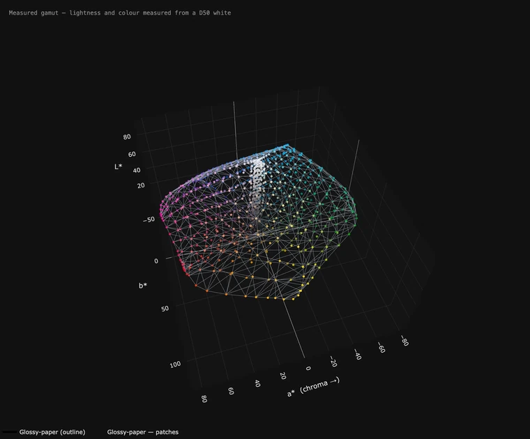
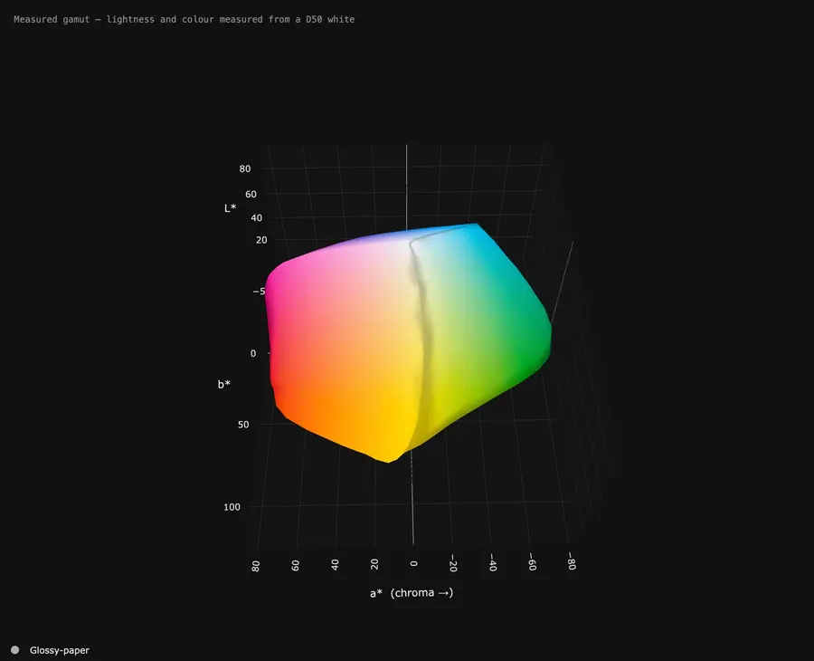
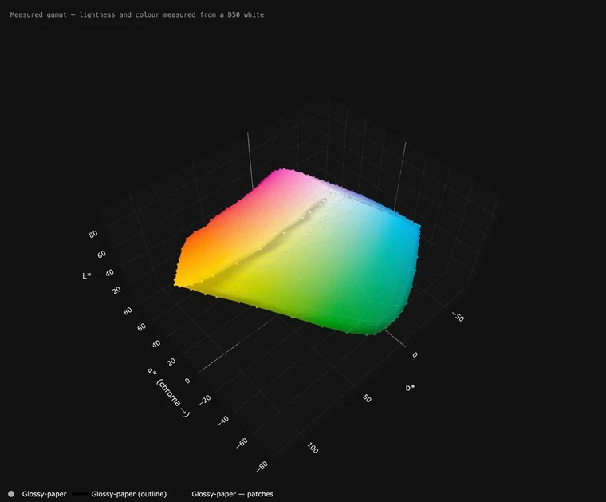
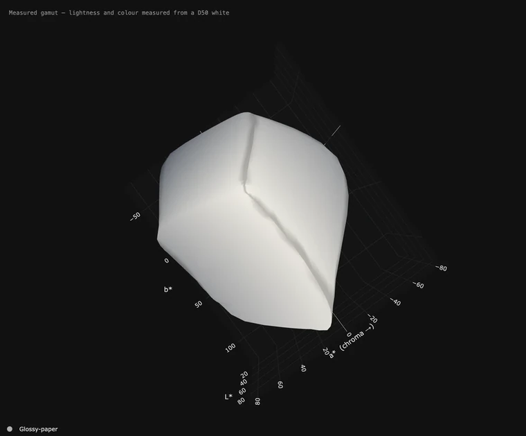
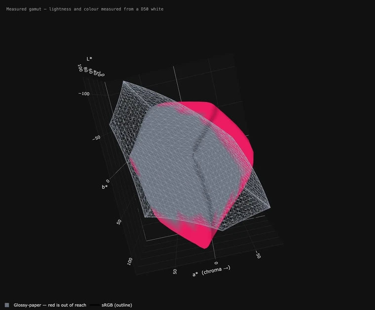
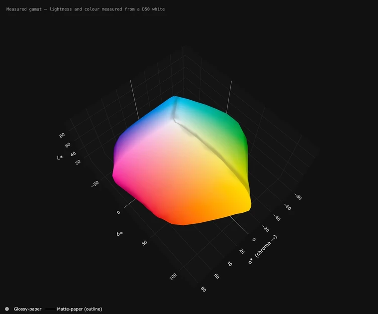

# It moves — six loops

Every one of these was made by the application itself: **Turn it by itself**
to set the movement, then **Save this view as a picture… → A moving picture**.
Nothing here was recorded another way, and every setting behind them is one
you have.

They are on their own page because they come to about ten megabytes together,
and a README that loads them on every visit is a slow README. Two of them live
there; all six live here.

Depth is genuinely hard to judge on a flat screen — a dent in the deep blues
and a shadow look alike in a still picture. That is what these are for.

---

## The cage, with every patch that made it

The surface as an outline only, with all 1168 measured patches floating in
place. This is the honest picture of what a measured gamut *is*: not a smooth
solid, but a cloud of real readings with a skin stretched over the outermost
of them. Watch the points near the edge — those are the ones deciding the
shape.

**How:** First shape → *outline only*, **Show every patch I measured** on.
Left and right *back and forth* 70° at speed 11, up and down *back and forth*
30° at speed 7.

## A slow turn, in its true colours

The whole way round, once, in the colours the paper actually produced.

**How:** Left and right → *all the way round* at speed 8. 8 seconds.

## The solid with its mesh, and its patches

The same shape filled in, with the mesh over it and the patches on top — so
you can see the surface and the evidence for it at once.

**How:** First shape → *solid with its mesh*, patches on, both axes swinging.

## Over the top and under the floor

A tilt-led swing of 110°, painted by lightness rather than by colour. This is
the view a turntable never gives you: the flat lid near white, and how the
shape closes in towards black underneath.

**How:** Up and down → *back and forth* 110° at speed 12, left and right a
gentle 30°. **How the shapes are coloured** → *By lightness*.

## What sRGB cannot reach

The paper against sRGB, with everything sRGB cannot reproduce picked out. The
red regions are the answer to "will my images survive on this paper".

**How:** **Compare with** → *sRGB*, **Show what the comparison cannot print**
on.

## Two papers, one inside the other

Glossy solid, matte as an outline around it, turning together. Which paper
holds more colour, and exactly where.

**How:** open both, second shape → *outline only*, left and right *all the way
round*.

---

## Making your own

1. Open a measurement or a profile.
2. Tick **Turn it by itself** and set **Left and right** and **Up and down** —
   *back and forth* keeps the shape facing you, *all the way round* carries it
   through a circle.
3. **Save this view as a picture… → A moving picture**, choose WebP, how long
   and how large.

The loop always joins up exactly: the file holds one complete journey fitted
into the seconds you asked for, whatever the speed slider says. A moving
picture is copied from the window, so the window's size is as large as it can
be.
