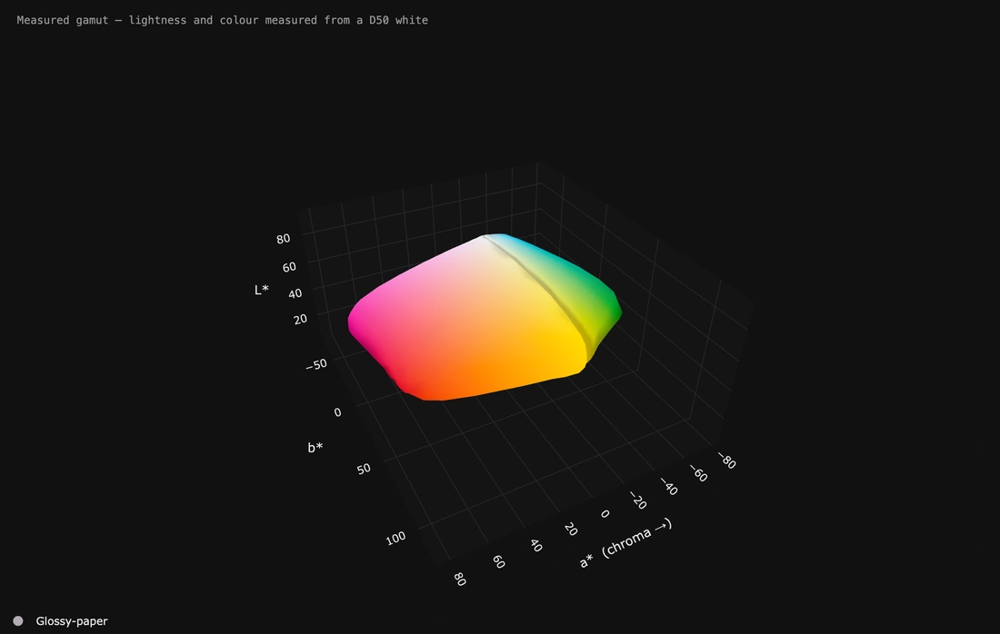
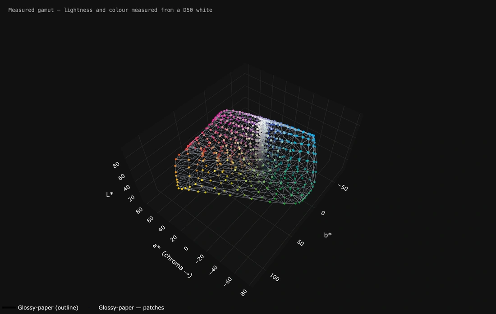

# It moves — all the way round, and the cage that made it

Every one of these was made by the application itself: **Turn it by itself**
to set the movement, then **Save this view as a picture… → A moving picture**.
Nothing was recorded another way, and every setting behind them is one you
have — each caption says exactly which.

Two to a page, so each one can be full size and full quality rather than
squeezed to fit a dozen onto one. **Depth is genuinely hard to judge on a flat
screen**: a dent in the deep blues and a shadow look exactly alike in a still
picture, and half a turn settles it in a second.

**They close exactly.** The file holds one complete journey — once round for a
full turn, once there and back for a swing — fitted into the seconds you asked
for. That is what stops a loop jumping every time it comes round.

---

*Page 1 of 6*

---

## The whole surface, once round.

**The whole surface, once round.**

One complete turn of a single measured paper. Every dent and bulge in it is a real reading — this is not a model of the printer, it is what came off it. The flat face at the back is where the deep blues run out, and it is invisible from the front, which is the entire reason these move.

**How:** First shape → *solid*. Left and right **all the way round** at speed 7, up and down off. Eight seconds, 25 a second.

---

## What a measured gamut actually is.

**What a measured gamut actually is.**

The surface as an outline only, with all 1168 measured patches floating in place. Not a smooth solid — a cloud of real readings with a skin stretched over the outermost of them. Watch the points near the edge: those are the ones deciding the shape, and everything inside is along for the ride.

**How:** First shape → *outline only*, **Show every patch I measured** on. Left and right *back and forth* 74° at speed 10, up and down *back and forth* 30° at speed 6. Seven seconds.

---

[The README](../README.md) · [Next →](motion/page-2.md)

***1** · [2](motion/page-2.md) · [3](motion/page-3.md) · [4](motion/page-4.md) · [5](motion/page-5.md) · [6](motion/page-6.md)*