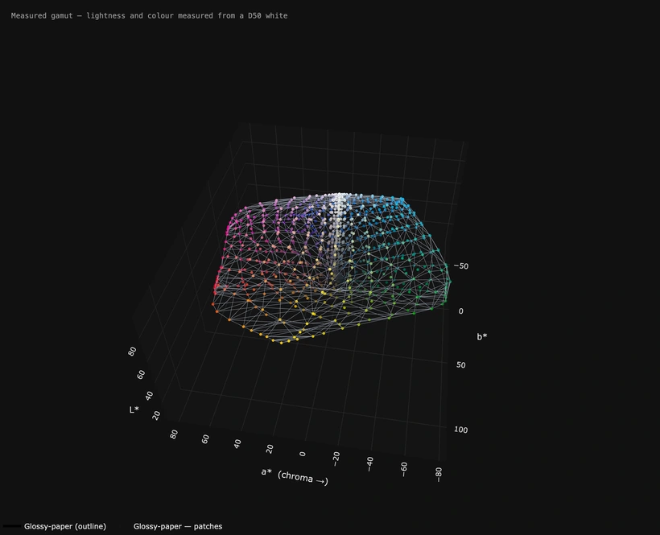
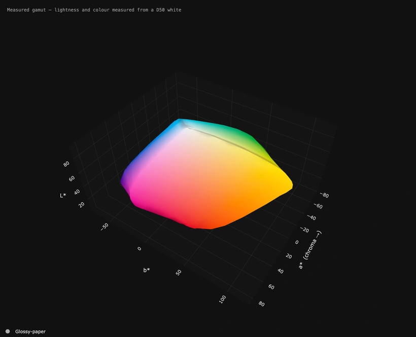
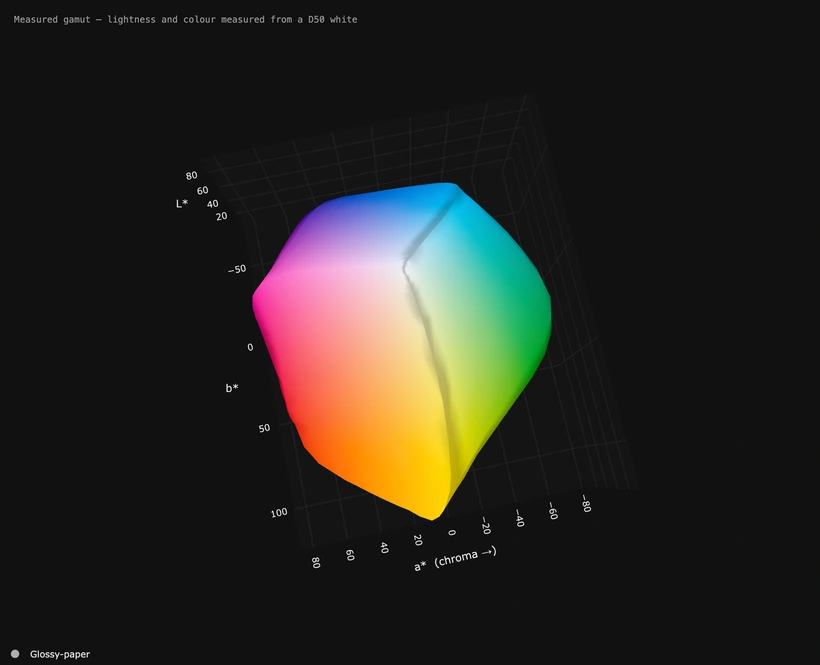
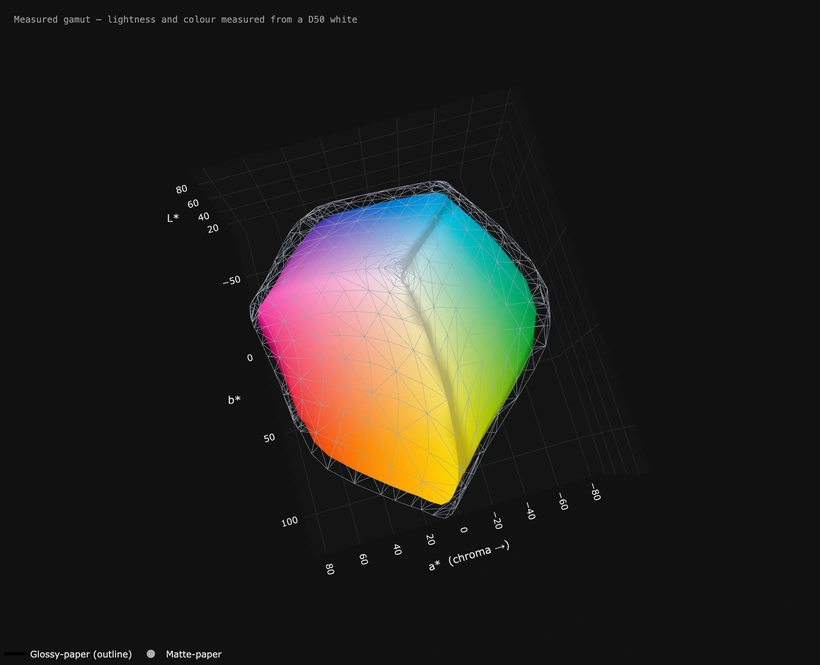
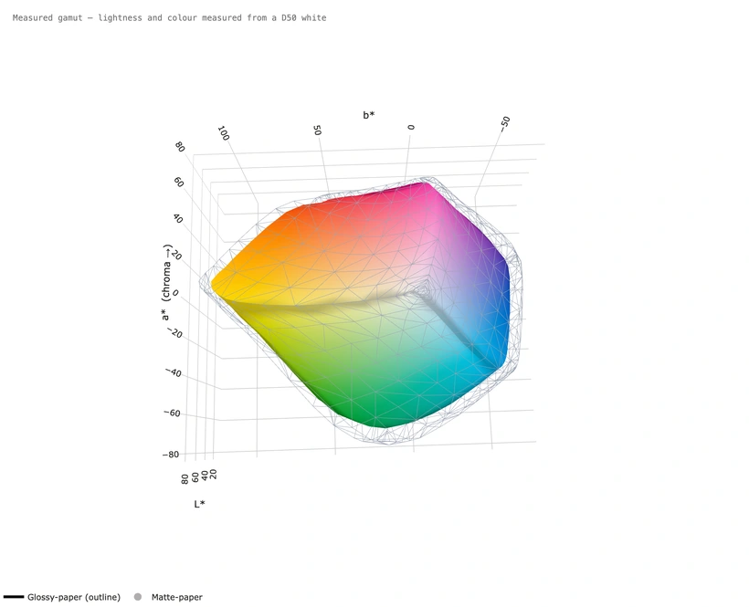
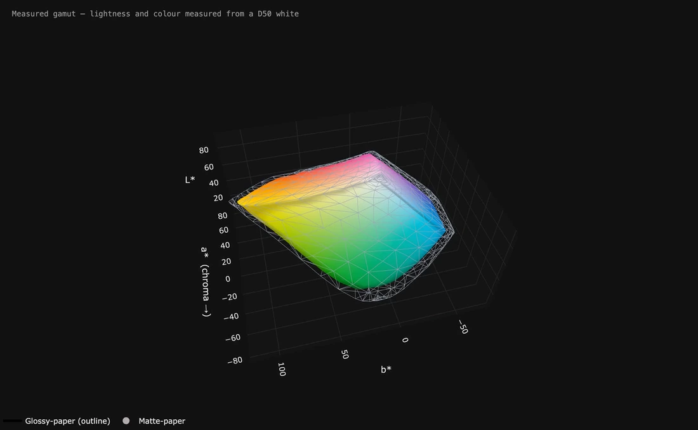

# It moves — six loops, and one film

Every one of these was made by the application itself: **Turn it by itself**
to set the movement, then **Save this view as a picture… → A moving picture**.
Nothing here was recorded another way, and every setting behind them is one
you have. Each caption says exactly which.

They live on their own page because they come to about thirty megabytes
together, and a README that loads all of that on every visit is a slow
README. The one at the top of the README is the hero; these are the rest.

**Why loops at all.** Depth is genuinely hard to judge on a flat screen — a
dent in the deep blues and a shadow look exactly alike in a still picture.
Half a turn settles it in a second.

**They close exactly.** The file holds one complete journey — once round for a
full turn, once there and back for a swing — fitted into the seconds you
asked for. That is what stops a loop jumping every time it comes round.

---

## The cage, with every patch that made it

The surface as an outline only, with all 1168 measured patches floating in
place. This is the honest picture of what a measured gamut *is*: not a smooth
solid, but a cloud of real readings with a skin stretched over the outermost
of them. Watch the points near the edge — those are the ones deciding the
shape.

**How:** First shape → *outline only*, **Show every patch I measured** on.
Left and right *back and forth* 74° at speed 10, up and down *back and forth*
30° at speed 6. Seven seconds, 25 a second.

---

## What sRGB cannot reach

The same paper, compared against sRGB, with every part of its surface that
sRGB cannot reproduce marked on it. A full turn, because the answer is
different on every side — this printer beats sRGB comfortably in the cyans and
loses to it in the deep blues, and one still picture can only ever show you
one of those.

**How:** *Compare with* → **sRGB**. Left and right *all the way round* at
speed 8, up and down *back and forth* 20° at speed 5. Eight seconds.

---

## Right over the top

Mostly up and down rather than round. A printer gamut is about twice as wide
in colour as it is tall in lightness, so from a low eye it reads as a flat
sheet — this tips the view right over the top of it, which is the one angle
that shows how the lightest colours close in to white.

**How:** Left and right *back and forth* 30° at speed 5, up and down *back and
forth* 78° at speed 11. Seven seconds.

---

## One paper inside another

Two papers at once — and drawn deliberately this way round. The glossy paper
holds more colour than the matte, so drawing *both* as solids means the bigger
one simply swallows the smaller and all anybody sees is the outer shell. The
one on the outside is an **outline**, so the paper inside stays visible and
the gap between them is the answer you came for.

**How:** Open both. First shape → *outline only*, second shape → *solid*.
Left and right *all the way round* at speed 8, up and down *back and forth*
24° at speed 5. Eight seconds.

---

## Dressed for a white page

The same shape, dressed for somewhere else entirely. Nothing about the
measurement changed — only what is behind it, what the three walls are, and
what colour the numbers and grid lines come out.

**How:** **Viewer and export styling** → *How it should look* → **For a white
document**. With **Live preview** ticked the window itself looked like this
while it was set up, which is the point of it: the lettering following the
background is not a setting anybody should have to think about, and on a white
page the screen's pale grey is very nearly invisible.

---

## And the same thing as a film

**[▶ Play the film (MP4, 1.4 MB)](screenshots/m6-as-a-film.mp4)**

Exactly the same loop, saved as an **MP4 (H.264)** instead of a WebP. The
picture above is one frame of it, because a film does not play by itself in a
README the way a moving picture does — and that is the whole trade.

A film is markedly smaller: this one is **1.4 MB against about 6 MB** for the
same frames as a WebP, because a film stores what changed rather than every
frame. Choose one for anything long or large, or for anywhere with a player.
Choose a moving picture for anywhere it has to start on its own with nothing
to press.

**H.265** is smaller again, on devices from about 2016 onwards. **WebM (VP9)**
is the only moving kind here that can be see-through, which is what you want
for a web page.

**How:** *Kind of file* → **MP4 (H.264)**, quality 93. The films are made by
ffmpeg, and a copy travels with the application — there is nothing to install.

---

## Making your own

1. **Turn it by itself** in the left-hand column — set left and right, up and
   down, or both. *Back and forth* over a modest sweep usually reads better
   than a full turn: the eye follows one part of the surface instead of
   losing it round the back.
2. **Viewer and export styling** — pick where the picture is going. With
   **Live preview** on, the window shows you the answer straight away.
3. **Save this view as a picture… → A moving picture**, then choose the kind
   of file, how wide, how long and how smooth. The line under the button says
   how large the file will be before you make it.

The **How fast** slider in the main window does not change the saved file at
all — it only changes what you are watching. The file always holds exactly one
complete journey fitted into the seconds you asked for, and that is precisely
what lets it join up perfectly. If a saved loop looks too quick, ask for more
seconds.

If a surface seems to shimmer as it turns, raise **Quality** to 95 or so. The
encoder makes a slightly different job of each frame, and a large smooth
surface is exactly where the eye notices that.
