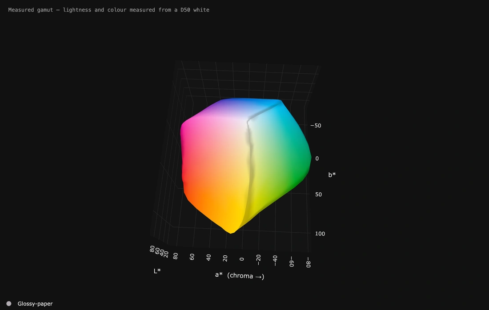
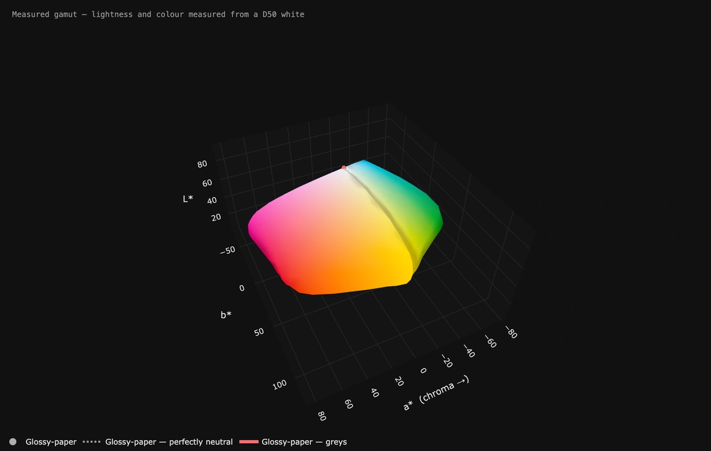

# It moves — over the top, and the greys hiding inside

*Page 2 of 6*

---

## The one angle a still picture never shows.

**The one angle a still picture never shows.**

Mostly up and down rather than round. A printer gamut is about twice as wide in colour as it is tall in lightness, so from a low eye it reads as a flat sheet. Tipping right over the top shows how the lightest colours close in towards white — and how far from a point that really is.

**How:** Left and right *back and forth* 30° at speed 5, up and down *back and forth* 78° at speed 11. Seven seconds.

---

## The line down the middle.

**The line down the middle.**

**Show the greys** draws the neutral axis your printer actually produced, running up the inside of the solid from the darkest black to the paper white. If it leans, your greys have a cast — and a lean is far easier to see turning than in any still, because you can watch it against the shape around it.

The shell is turned down to about a third solid, because at full strength it is an opaque object and the line inside it simply cannot be seen. Anything drawn *inside* the shape needs this.

**How:** **Show the greys** on, and **…and a perfectly neutral line** under it — the dotted line is where the greys would run with no colour in them at all, so the lean is read against something straight rather than guessed at. Ticking either turns the shape down to 38 for you, because a line inside an opaque solid cannot be seen. Left and right *back and forth* 58° at speed 7, up and down *back and forth* 14° at speed 4. Seven seconds.

---

[← Previous](../MOTION.md) · [The README](../../README.md) · [Next →](page-3.md)

*[1](../MOTION.md) · **2** · [3](page-3.md) · [4](page-4.md) · [5](page-5.md) · [6](page-6.md)*