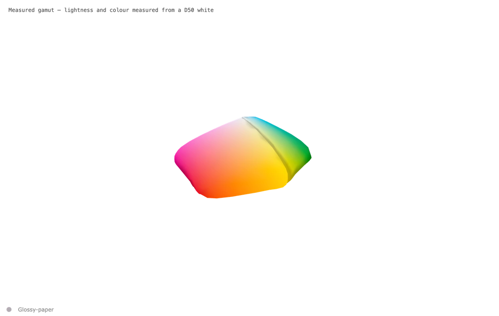
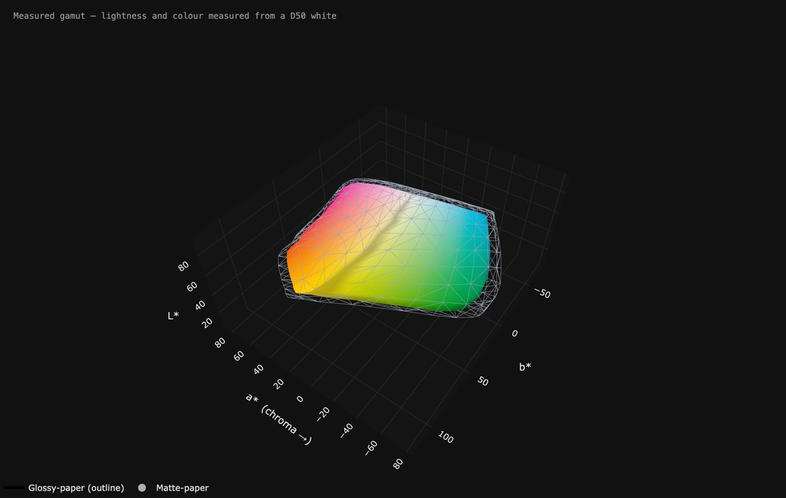

# It moves — nothing around it, and one paper inside another

*Page 3 of 6*

---

## Cut out, and it takes this page as its own background.

**Cut out, and it takes this page as its own background.**

No box, no grid, and nothing behind it — this file has a see-through background, so it is sitting directly on whatever colour this page happens to be. If you are reading GitHub in dark mode it is on the dark; in light mode, on the white. Nothing was done twice.

A copy of the screen has no see-through in it, so this is recovered by drawing every frame twice, once on white and once on black, and subtracting the two. That is exact rather than a trick, and it keeps the soft edges.

**How:** Untick **Show the box and its grid**. **Viewer and export styling** → *Cut out — light page*, with the lettering set to a mid grey so it reads on either. Saved as WebP, which can hold see-through; for a film, WebM (VP9) is the one that can.

---

## Two papers, and which way round matters.

**Two papers, and which way round matters.**

Glossy holds more colour than matte, so drawing both as solids means the bigger one swallows the smaller and all you see is one shape. The one on the **outside** is the outline, so the paper inside stays visible — and the gap between them is the answer you came for.

**How:** Open both. First shape → *outline only*, second shape → *solid*. Left and right **all the way round** at speed 8, up and down *back and forth* 22° at speed 5. Eight seconds.

---

[← Previous](page-2.md) · [The README](../../README.md) · [Next →](page-4.md)

*[1](../MOTION.md) · [2](page-2.md) · **3** · [4](page-4.md) · [5](page-5.md) · [6](page-6.md)*