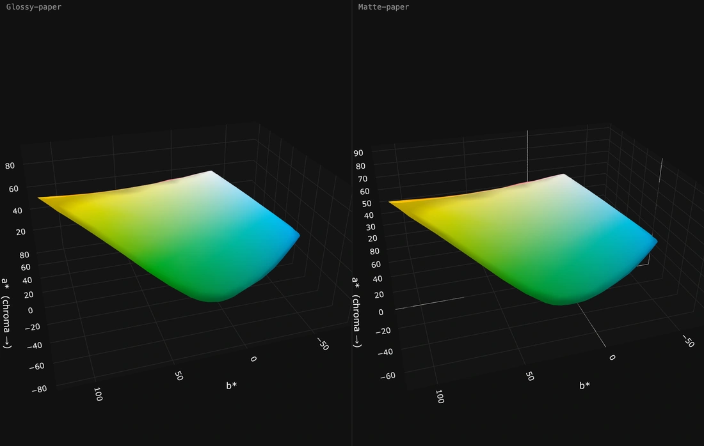
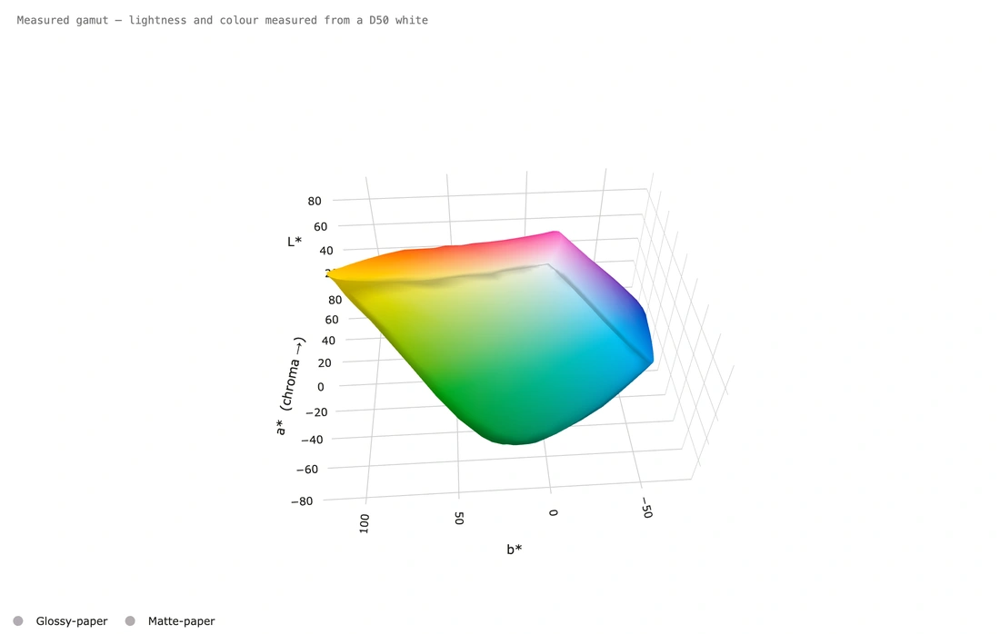

# It moves — two rooms, and dressed for a white page

*Page 4 of 7*

---

## Side by side, kept pointing the same way.

**Side by side, kept pointing the same way.**

Two papers in rooms of their own rather than overlaid. **Keep both rooms pointing the same way** links the cameras, so you are always comparing the same face of both — which is the whole reason to put them side by side, and the thing that makes it honest.

**How:** **Show them in two rooms, side by side** on. Left and right **all the way round** at speed 7. Eight seconds.

---

## The same measurement, dressed for somewhere else.

**The same measurement, dressed for somewhere else.**

Nothing about the reading changed — only what is behind it, what the three walls are, and what colour the numbers and grid lines come out. On a white page the screen's pale grey lettering is very nearly invisible, so it follows the background instead. That is not a setting anybody should have to think about, and here nobody does.

**How:** **Viewer and export styling** → *For a white document*. With **Live preview** ticked the window itself looked like this while it was set up.

---

[← Previous](page-3.md) · [The README](../../README.md) · [Next →](page-5.md)

*[1](../MOTION.md) · [2](page-2.md) · [3](page-3.md) · **4** · [5](page-5.md) · [6](page-6.md) · [7](page-7.md)*