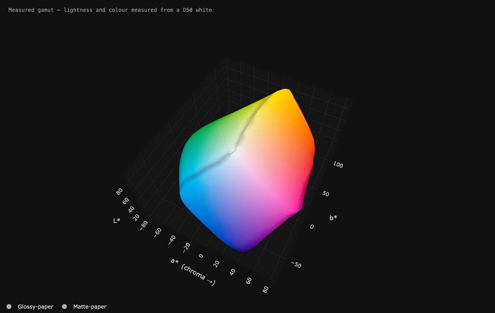

# It moves — and the same thing as a film

*Page 5 of 6*

---

## A film instead of a moving picture.

**[▶ Play the film (MP4)](../screenshots/g9-as-a-film.mp4)**

**A film instead of a moving picture.**

Exactly the same loop saved as an **MP4 (H.264)**. It is **1.1 MB against about 8 MB** for the same frames as a WebP, because a film stores what changed rather than every frame, and a shape turning slowly changes very little.

The trade is the play button: a film does not start by itself on a page like this, which is why every other loop here is a WebP. Choose a film for anything long or large, or anywhere with a player; choose a moving picture for anywhere it has to start on its own.

**H.265** is smaller again on devices from about 2016 onwards, and **WebM (VP9)** is the only moving kind that can be see-through.

**How:** *Kind of file* → **MP4 (H.264)**, quality 95. Films are made by ffmpeg, and a copy travels with the application — there is nothing to install.

---

## A photograph, and the colours the paper cannot print.

**A photograph, and the colours the paper cannot print.**

The fourth kind of file this opens is an ordinary picture, and what it draws is *the colours actually in that picture* rather than the space it was saved in. Here a real photograph sits inside the cage of a paper that was measured, and **92.7% of it fits**. That is the number people want before they print.

**Red is where its surface passes the paper**, not how much of it is lost — a thin shell of unreachable colour wraps a good deal of a shape while adding up to very little of its volume, so the picture and the percentage answer two different questions and both are worth having. The spikes are what a camera catches and a paper cannot: deep saturated corners, always the first thing to go.

**How:** the photograph opened **first** and the measurement second, because **Show what the comparison cannot print** paints the first shape against the second — the other way round paints the paper against the photograph, which is true and useless. Photograph → *solid*, paper → *outline*.

---

[← Previous](page-4.md) · [Next →](page-6.md) · [The README](../../README.md)

*[1](../MOTION.md) · [2](page-2.md) · [3](page-3.md) · [4](page-4.md) · **5** · [6](page-6.md)*