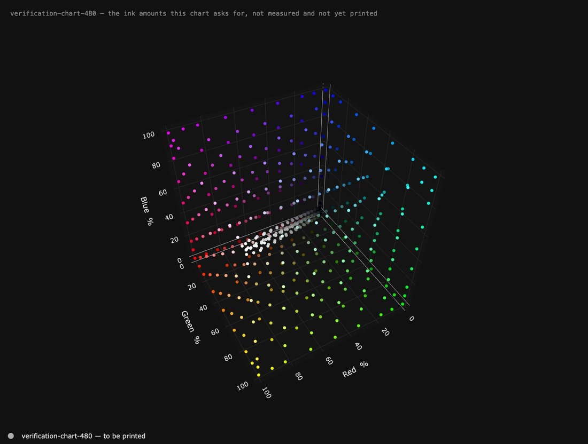
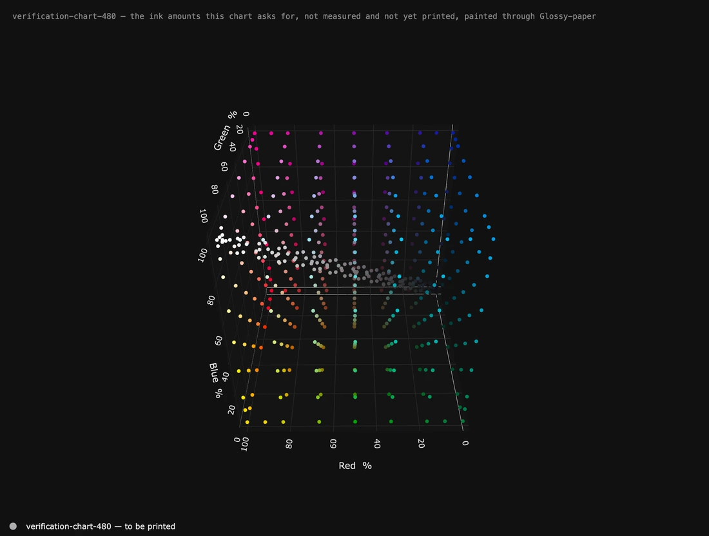
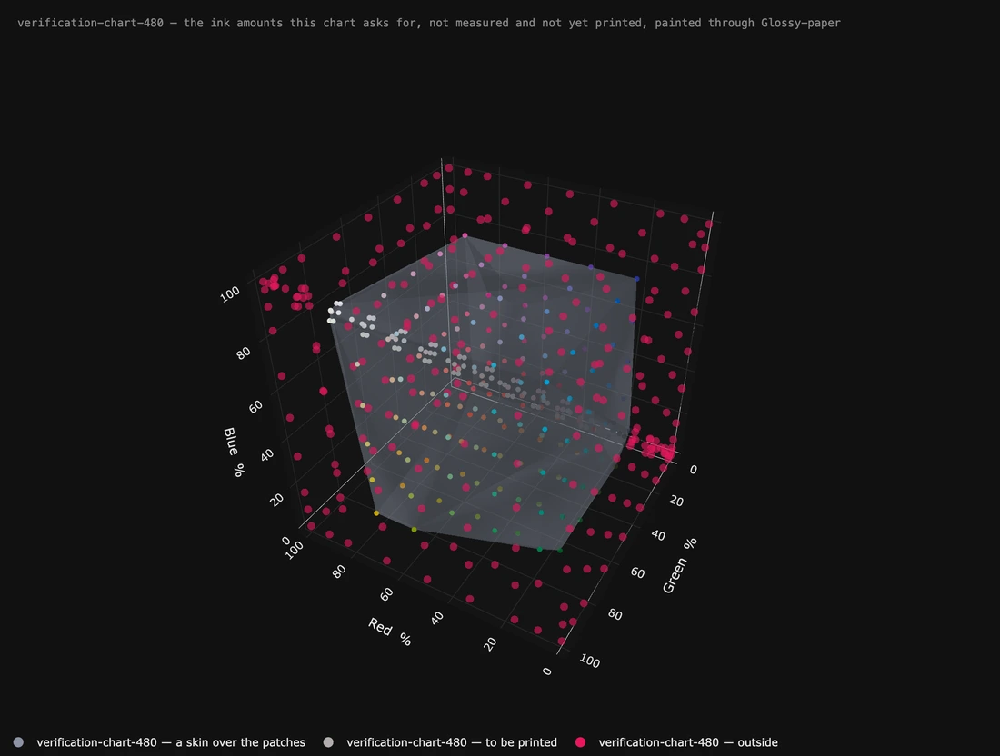
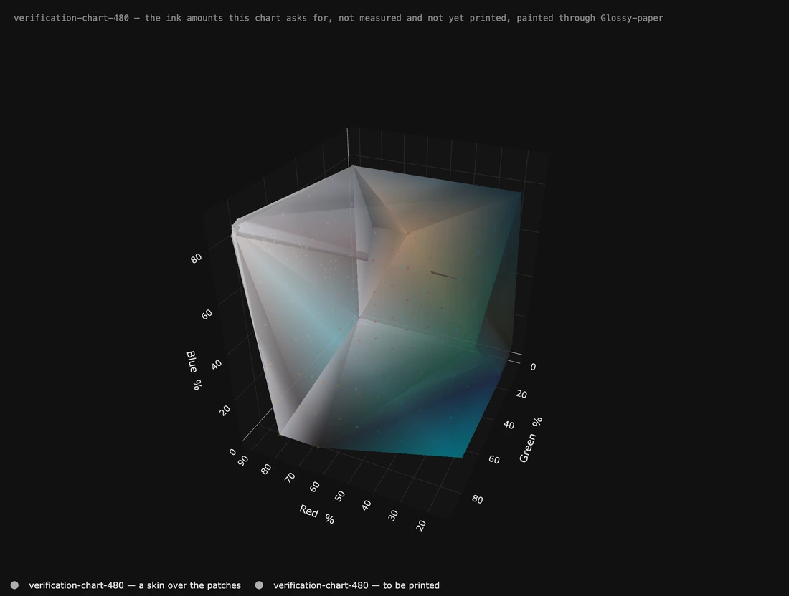
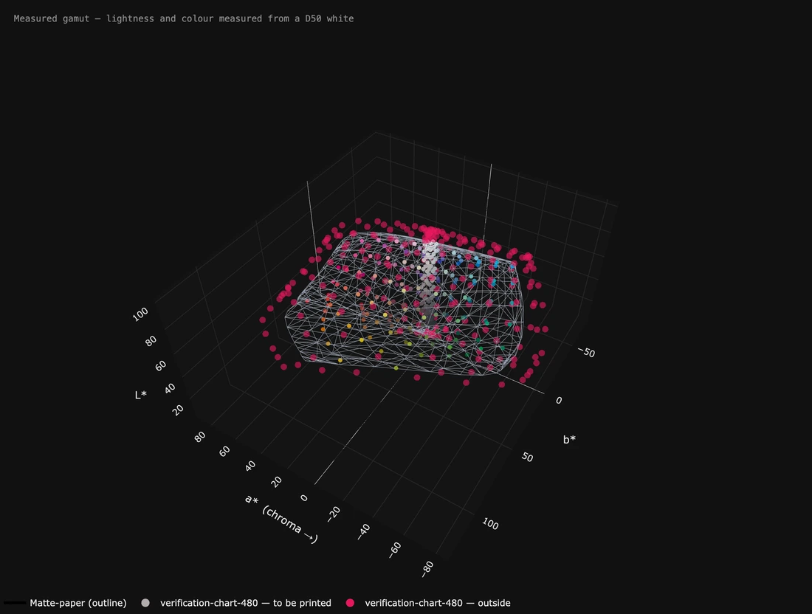
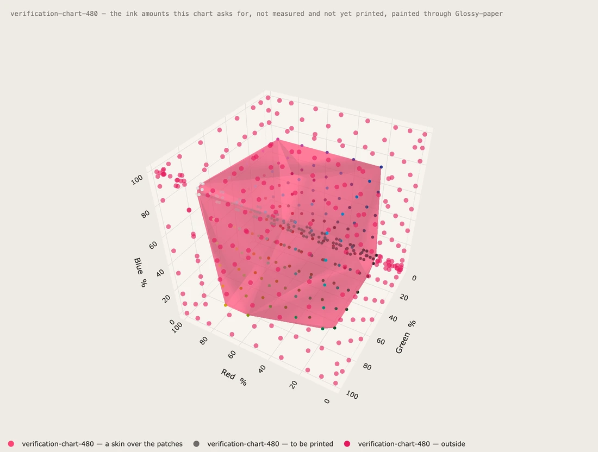

# It moves — a chart, before anything has been printed

*Page 7 of 7*

---

Everything on this page is a **chart**: a list of ink amounts waiting to be
printed, opened with **Open a chart to be printed…**. Nothing here has been
measured. Every loop was made by the application itself — **Turn it by
itself**, then **Save this view as a picture… → A moving picture** — and each
caption says exactly which settings are behind it.

---

## A patch set on its own, with nothing else at all.

**A patch set on its own, with nothing else at all.**

No profile. No measurement. No printer. The three axes are the printer's own
controls — how much of each ink, 0 to 100 — which is exactly what the file
contains, so the numbers on the axes are the numbers in the file and nothing
here is predicted.

What it answers is a question about **the chart**: how evenly it samples the
range the printer can be asked for, where it crowds, and where it leaves a
hole. The dots are painted with the ink amounts read as screen colour, which
is a legend and not a prediction — the panel says so beside them.

**How:** **Draw it in** → *Ink amounts — a chart on its own*. Left and right
**all the way round** at speed 8, up and down *back and forth* 18° at speed 5.
Eight seconds, 25 a second.

---

## The same patches, with a profile asked what colour they will be.

**The same patches, with a profile asked what colour they will be.**

Hold this against the one above: **not a single dot has moved.** The ink
amounts *are* the axes, so a profile cannot move anything — it is the only
thing that can say what colour each amount will come out as, so it paints
them and nothing else.

The colours are noticeably quieter than the loop above, and that is the whole
point of the pair. The bright cube is what the numbers *look like on a screen*;
this is what the paper will actually give you.

**How:** as above, plus **Placed through** → the profile the chart was built
for.

---

## What a different paper cannot reach — and where it lives.

**What a different paper cannot reach — and where it lives.**

The grey skin covers the patches the matte paper **can** reach. Everything in
red is out of its reach — and the shape of the loss is the finding: the losses
are the entire **outer shell** of the ink range, with the interior surviving
intact. In CIELAB those same 160 patches are scattered through the shape and
that pattern cannot be seen at all.

The counts are identical in both views, because the judging is about colour and
the space is only how it is drawn.

**How:** the chart, its profile under **Placed through**, and the matte paper's
measurement open. **A skin over the patches** → *Mesh*, grey, and the
out-of-reach dots turned down to 60% so the skin reads through them.

---

## The chart's own reach, as a solid.

**The chart's own reach, as a solid.**

The same skin with the dots turned almost off and the surface taking the
colours of the patches it is stretched over. This is the chart's reach as a
shape rather than as a cloud.

**It is not a gamut, and the window never lets it become one.** A chart only
samples wherever its author put a patch: on these files the skin comes out 8%
smaller than the paper's own measured gamut. So it never joins **How much
colour it holds**, never joins a comparison, and is named *a skin over the
patches* in the key.

**How:** **A skin over the patches** → *Solid*, *The colours of the patches*,
70% solid. **How big the dots are** at its lowest and 25% solid.

---

## The same chart and the same paper, in CIELAB.

**The same chart and the same paper, in CIELAB.**

Everything comes back the moment a colour space is chosen: the paper is drawn
again as a shape, and the patches sit where the profile says they will land.

Worth watching next to the loop three above. The **numbers are identical** —
222 inside, 18 on the edge, 240 outside — and the **picture is not**. Here the
red is spread all round the surface; there it was one clean shell. Two true
pictures of one measurement, answering different questions.

**How:** **Draw it in** → *CIELAB*, first shape → *outline only*.

---

## Light, and in the accent colour.

**Light, and in the accent colour.**

None of this has to be dark. The whole window and everything it saves follow
**Light** under **This window**, and a skin can take the accent colour instead
of grey or the patches' own — which is the one to use when the shape is the
subject and the dots are only there for texture.

**How:** **Light**, **A skin over the patches** → *Solid*, *The accent colour*,
45% solid. Left and right *back and forth* 80° at speed 7, up and down *back
and forth* 24° at speed 5.

---

**One more thing, and it is not obvious:** the names under any of these
pictures are switches. Click one to hide that shape, click again to bring it
back, double-click to show it on its own. Nothing is closed and no figure
changes — it is a way of looking.

---

[← Previous](page-6.md) · [The README](../../README.md)

*[1](../MOTION.md) · [2](page-2.md) · [3](page-3.md) · [4](page-4.md) · [5](page-5.md) · [6](page-6.md) · **7***
